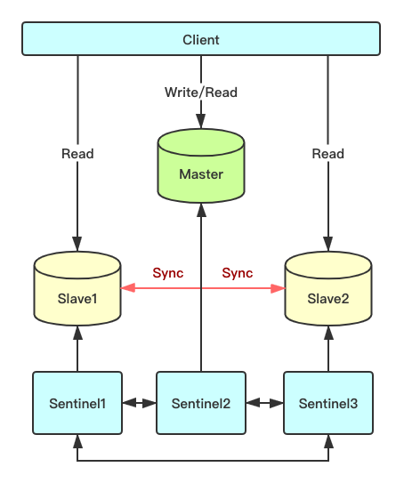
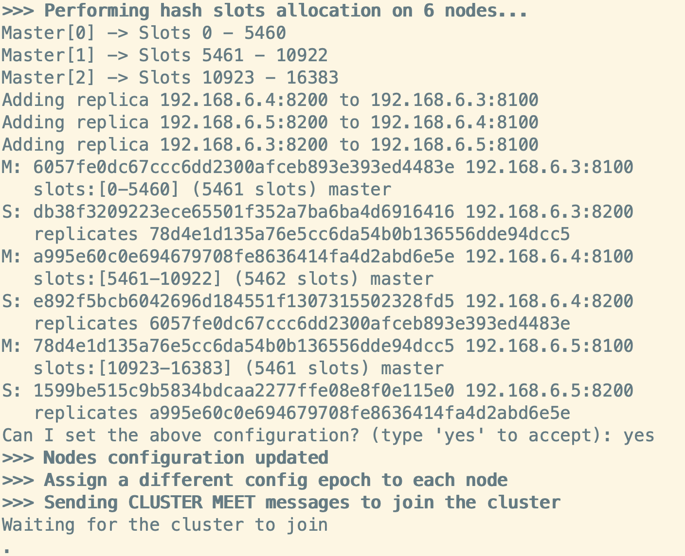

### 1. Redis介绍
Redis是完全**开源**的，遵守 BSD 协议，是一个高性能的 **key-value** 数据库。

Redis与其他key-value缓存产品有以下三个特点：
* Redis支持数据的持久化，可以将内存中的数据保存在磁盘中，重启的时候可以再次加载进行使用。
* Redis不仅仅支持简单的key-value类型的数据，同时还提供list，set，zset，hash等数据结构的存储。
* Redis支持数据的备份，即master-slave模式的数据备份。

### 2. Redis应用场景
* 热点数据（数据查询、短连接、新闻内容、商品内容等等）**缓存**。
* 分布式集群架构中的共享session。
* 聊天室的在线好友列表（bitmap）
* 任务队列（秒杀、抢购、12306等等）。
* 应用排行榜。
* 网站访问统计。
* 数据过期处理（可以精确到毫秒）。

### 3. Redis安装
3.1. 通过[Redis官网](https://redis.io/)下载压缩包或者通过命令行下载：
```
wget http://download.redis.io/releases/redis-6.0.8.tar.gz
```
3.2. 解压并且编译：
```
tar xzf redis-6.0.8.tar.gz
cd redis-6.0.8
make install
```
3.3. 编译完成后，会生成`bin`目录，
```
cd ./bin
ls
```
目录下含有如下文件：
```
redis-benchmark  # redis性能测试工具
redis-check-aof  # AOF文件修复工具
redis-check-rdb  # RDB文件修复工具
redis-cli  # redis命令行客户端
redis.conf  # redis配置文件
redis-sentinal  # redis集群管理工具
redis-server  # redis服务进程
```

3.4. 将配置文件`redis.conf`复制到`bin`目录下。
```
cp ../redis.conf ./
```

3.5. 前端启动redis-server
```
./redis-server
```
如图：

> `./redis-server`使用的是默认配置。如果需要加载配置文件启动，可以使用命令：`./redis-server ./redis.conf`。

3.6. 后端启动redis-server
第5步中是以前端方式启动的redis，这种方式启动的缺点是ssh命令窗口关闭则redis-server程序结束，不推荐使用此方法，推荐使用后端启动方式。
修改配置文件redis.conf，将`daemonize no` 修改为 `daemonize yes`，然后加载配置文件进行启动：
```
./redis-server ./redis.conf
```
使用`ps`命令验证下：
```
ps aux | grep redis
# hadoop   17537  0.0  0.3  69708  3644 ?        Ssl  15:25   0:00 ./redis-server 127.0.0.1:6379
# hadoop   17567  0.0  0.0  21536   992 pts/0    S+   15:25   0:00 grep --color=auto redis
```

3.7. 启动redis-cli，连接redis服务
```
./redis-cli
```


3.8. 关闭redis-server。在redis-cli内使用命令：
```
shutdown
```

3.9. 退出redis-cli，使用命令 `exit` 或者 `quit`。

### 4. 配置文件详解
4.1. 基础参数配置
```
# 是否在后台执行，yes: 后台运行；no: 前台运行（默认no）
daemonize yes

# 是否开启保护模式（默认开启）
# 要是配置里没有指定bind和密码。
# 开启该参数后，redis只会本地进行访问，拒绝外部访问。
# 要是开启了密码和bind，可以开启。否则最好关闭，设置为no。
protected-mode yes

# redis的进程文件
pidfile /var/run/redis/redis-server.pid

# redis监听的端口号
port 6379

# 此参数确定了TCP连接中已完成队列的长度(默认511)
tcp-backlog 511

# 指定redis只接收指定IP地址的请求
# 如需处理所有请求（远程访问） bind 0.0.0.0
bind 127.0.0.1

# 配置unix socket来让redis支持监听本地连接。
unixsocket /var/run/redis/redis.sock

# 配置unix socket使用文件的权限
unixsocketperm 700

# 此参数为设置客户端空闲超过timeout，服务端会断开连接，为0则服务端不会主动断开连接，不能小于0。
timeout 0

# tcp keepalive参数。
# 如果设置不为0，就使用配置tcp的SO_KEEPALIVE值，使用keepalive有两个好处:检测挂掉的对端。
# 降低中间设备出问题而导致网络看似连接却已经与对端端口的问题。
# 在Linux内核中，设置了keepalive，redis会定时给对端发送ack。
# 检测到对端关闭需要两倍的设置值。
tcp-keepalive 0

# 指定了服务端日志的级别
# debug（适合开发、测试环境）
# verbose（较少于debug级别 适合开发、测试环境）
# notice（适合生产环境）
# warn（只有非常重要的信息）
loglevel notice

# 指定了记录日志的文件。空字符串的话，日志会打印到标准输出设备。
# 后台运行的redis标准输出是/dev/null。
logfile /var/log/redis/redis-server.log

# 是否打开记录syslog功能
# syslog-enabled no

# syslog的标识符
# syslog-ident redis

# 日志的来源、设备
# syslog-facility local0

# 数据库的数量（默认16）
databases 16
```

4.2.持久化配置
```
# 注释掉 `save` 这一行配置项就可以让保存数据库功能失效
# 设置redis进行数据库镜像的频率。
# 900秒（15分钟）内至少1个key值改变（则进行数据库保存--持久化）
# 300秒（5分钟）内至少10个key值改变（则进行数据库保存--持久化）
# 60秒（1分钟）内至少10000个key值改变（则进行数据库保存--持久化）
save 900 1
save 300 10
save 60 10000

# 当rdb持久化出现错误后，是否依然进行继续进行工作，
# yes：不能进行工作，
# no：可以继续进行工作，
# 可以通过info中的rdb_last_bgsave_status了解RDB持久化是否有错误
stop-writes-on-bgsave-error yes

# 使用压缩rdb文件
# yes：压缩，但是需要一些cpu的消耗
# no：不压缩，需要更多的磁盘空间
rdbcompression yes

# 是否校验rdb文件
rdbchecksum yes

# rdb文件的名称
dbfilename dump.rdb

# 数据目录，数据库的写入会在这个目录。rdb、aof文件也会写在这个目录
dir /var/lib/redis

# 默认redis使用的是rdb方式持久化，这种方式在许多应用中已经足够用了。
# 但是redis如果中途宕机，会导致可能有几分钟的数据丢失，根据save来策略进行持久化。
# Append Only File是另一种持久化方式，可以提供更好的持久化特性。
# Redis会把每次写入的数据在接收后都写入 appendonly.aof 文件，
# 每次启动时Redis都会先把这个文件的数据读入内存里，先忽略RDB文件。
appendonly no

# aof文件名
appendfilename "appendonly.aof"

# aof持久化策略的配置
# no表示不执行fsync，由操作系统保证数据同步到磁盘，速度最快。
# always表示每次写入都执行fsync，以保证数据同步到磁盘。
# everysec表示每秒执行一次fsync，可能会导致丢失这1s数据。
appendfsync everysec

# 在aof重写或者写入rdb文件的时候，会执行大量IO。
# 此时对于everysec和always的aof模式来说，执行fsync会造成阻塞过长时间，
# no-appendfsync-on-rewrite字段设置为默认设置为no。
# 如果对延迟要求很高的应用，这个字段可以设置为yes，否则还是设置为no，
# 这样对持久化特性来说这是更安全的选择。
# 设置为yes表示rewrite期间对新写操作不fsync,暂时存在内存中,
# 等rewrite完成后再写入。Linux的默认fsync策略是30秒。可能丢失30秒数据。
no-appendfsync-on-rewrite no

# aof自动重写配置。当目前aof文件大小超过上一次重写的aof文件大小的百分之多少进行重写，
# 即当aof文件增长到一定大小的时候Redis能够调用bgrewriteaof对日志文件进行重写。
# 当前AOF文件大小是上次日志重写得到AOF文件大小的二倍（设置为100）时，
# 自动启动新的日志重写过程。
auto-aof-rewrite-percentage 100

# 设置允许重写的最小aof文件大小，避免了达到约定百分比但尺寸仍然很小的情况还要重写
auto-aof-rewrite-min-size 64mb

# aof文件可能在尾部是不完整的，当redis启动的时候，aof文件的数据被载入内存。
# 重启可能发生在redis所在的主机操作系统宕机后，
# 尤其在ext4文件系统没有加上data=ordered选项(redis宕机或者异常终止不会造成尾部不完整现象)。
# 出现这种现象，可以选择让redis退出，或者导入尽可能多的数据。
# 如果选择的是yes，当截断的aof文件被导入的时候，会自动发布一个log给客户端然后load。
# 如果是no，用户必须手动redis-check-aof修复AOF文件才可以。
aof-load-truncated yes
```

4.3.主从配置
```
# 复制选项，slave复制对应的master
slaveof <masterip> <masterport>

# 如果master设置了requirepass，那么slave要连上master，需要有master的密码才行。
# masterauth就是用来配置master的密码，这样可以在连上master后进行认证
masterauth <master-password>

# 当slave同master失去连接或者复制正在进行，slave的运行方式
# 1.如果slave-serve-stale-data设置为yes(默认设置)，slave会继续响应客户端的请求。
# 2.如果slave-serve-stale-data设置为no，除去INFO和SLAVOF命令之外的任何请求都会返回一个错误”SYNC with master in progress”。
slave-serve-stale-data yes

# slave服务器读写配置
# 默认情况下是只读的（yes）
# 修改成no，可读可写（不建议）
slave-read-only yes

# 是否使用socket方式复制数据。
# 目前redis复制提供两种方式，disk和socket。
# 如果新的slave连上来或者重连的slave无法部分同步，就会执行全量同步，master会生成rdb文件。
# 有2种方式：
# 1. disk方式是master创建一个新的进程把rdb文件保存到磁盘，再把磁盘上的rdb文件传递给slave。
# 2. socket是master创建一个新的进程，直接把rdb文件以socket的方式发给slave。
# disk方式的时候，当一个rdb保存的过程中，多个slave都能共享这个rdb文件。
# socket的方式就的一个个slave顺序复制。在磁盘速度缓慢，网速快的情况下推荐用socket方式。
repl-diskless-sync no

# diskless复制的延迟时间，防止设置为0。
# 一旦复制开始，节点不会再接收新slave的复制请求直到下一个rdb传输。
# 所以最好等待一段时间，等更多的slave连上来。
repl-diskless-sync-delay 5

# slave根据指定的时间间隔向服务器发送ping请求
# 时间间隔可以通过 repl_ping_slave_period 来设置，默认10秒。
repl-ping-slave-period 10

# 复制连接超时时间。master和slave都有超时时间的设置。
# master检测到slave上次发送的时间超过repl-timeout，即认为slave离线，清除该slave信息。
# slave检测到上次和master交互的时间超过repl-timeout，则认为master离线。
# 需要注意的是repl-timeout需要设置一个比repl-ping-slave-period更大的值，不然会经常检测到超时。
repl-timeout 60

# 是否禁止复制tcp链接的tcp nodelay参数，可传递yes或者no。
# 默认是no，即使用tcp nodelay。
# 如果master设置了yes来禁止tcp nodelay设置，在把数据复制给slave的时候，会减少包的数量和更小的网络带宽。
# 但是这也可能带来数据的延迟。默认我们推荐更小的延迟，但是在数据量传输很大的场景下，建议选择yes。
repl-disable-tcp-nodelay no

# 复制缓冲区大小，这是一个环形复制缓冲区，用来保存最新复制的命令。
# 这样在slave离线的时候，不需要完全复制master的数据，如果可以执行部分同步，只需要把缓冲区的部分数据复制给slave，就能恢复正常复制状态。
# 缓冲区的大小越大，slave离线的时间可以更长，复制缓冲区只有在有slave连接的时候才分配内存。
# 没有slave的一段时间，内存会被释放出来，默认1m。
repl-backlog-size 5mb

# master没有slave一段时间会释放复制缓冲区的内存，repl-backlog-ttl用来设置该时间长度。
# 单位为秒。
repl-backlog-ttl 3600

# 当master不可用，Sentinel会根据slave的优先级选举一个master。
# 最低的优先级的slave，当选master。而配置成0，永远不会被选举。
slave-priority 100

# redis提供了可以让master停止写入的方式，如果配置了min-slaves-to-write，健康的slave的个数小于N，mater就禁止写入。
# master最少得有多少个健康的slave存活才能执行写命令。
# 这个配置虽然不能保证N个slave都一定能接收到master的写操作，
# 但是能避免没有足够健康的slave的时候，master不能写入来避免数据丢失。
# 设置为0是关闭该功能。
# min-slaves-to-write 3

# 延迟小于min-slaves-max-lag秒的slave才认为是健康的slave。
min-slaves-max-lag 10

# 设置1或另一个设置为0禁用这个特性。
min-slaves-max-lag is set to 10.
```

4.4.安全配置
```
# 配置redis连接密码（默认未启用，建议启用）
requirepass foobared

# 把危险的命令给修改成其他名称。
# 比如CONFIG命令可以重命名为一个很难被猜到的命令，这样外部连接不能使用，而服务器内部连接工具还能继续使用。
rename-command CONFIG cmd

# 设置成一个空的值，可以禁止一个命令
rename-command CONFIG ""
```

4.5. 连接配置
```
# 设置能连上redis的最大客户端连接数量。
# 默认是10000个客户端连接。
# 由于redis不区分连接是客户端连接还是内部打开文件或者和slave连接等，所以maxclients最小建议设置到32。
# 如果超过了maxclients，redis会给新的连接发送’max number of clients reached’，并关闭连接。
maxclients 10000

# redis配置的最大内存容量。
# 当内存满了，需要配合maxmemory-policy策略进行处理。
# 注意slave的输出缓冲区是不计算在maxmemory内的。所以为了防止主机内存使用完，建议设置的maxmemory需要更小一些。
maxmemory <bytes>

# 内存容量超过maxmemory后的处理策略。
# volatile-lru：利用LRU算法移除设置过过期时间的key。
# volatile-random：随机移除设置过过期时间的key。
# volatile-ttl：移除即将过期的key，根据最近过期时间来删除（辅以TTL）
# allkeys-lru：利用LRU算法移除任何key。
# allkeys-random：随机移除任何key。
# noeviction：不移除任何key，只是返回一个写错误。
# 上面的这些驱逐策略，如果redis没有合适的key驱逐，对于写命令，还是会返回错误。redis将不再接收写请求，只接收get请求。
maxmemory-policy noeviction

# lru检测的样本数。
# 使用lru或者ttl淘汰算法，从需要淘汰的列表中随机选择sample个key，选出闲置时间最长的key移除。
maxmemory-samples 5

# 如果达到最大时间限制（毫秒），redis会记个log，然后返回error。
# 当一个脚本超过了最大时限。只有SCRIPT KILL和SHUTDOWN NOSAVE可以用。
# 第一个可以杀没有调write命令的东西。
# 要是已经调用了write，只能用第二个命令杀。
lua-time-limit 5000
```

4.6.集群配置
```
# 集群开关，默认是不开启集群模式。
cluster-enabled yes

# 集群配置文件的名称，每个节点都有一个集群相关的配置文件，持久化保存集群的信息。
# 这个文件并不需要手动配置，这个配置文件有Redis生成并更新，
# 每个Redis集群节点需要一个单独的配置文件，请确保与实例运行的系统中配置文件名称不冲突
# cluster-config-file nodes-a.conf

# 节点互连超时的阀值。集群节点超时毫秒数
# cluster-node-timeout 15000

# 在进行故障转移的时候，全部slave都会请求申请为master，但是有些slave可能与master断开连接一段时间了，导致数据过于陈旧，这样的slave不应该被提升为master。
# 该参数就是用来判断slave节点与master断线的时间是否过长。判断方法是：
# 比较slave断开连接的时间和(node-timeout * slave-validity-factor) + repl-ping-slave-period
# 如果节点超时时间为三十秒, 并且slave-validity-factor为10, 
# 假设默认的repl-ping-slave-period是10秒，即如果超过310秒slave将不会尝试进行故障转移
cluster-slave-validity-factor 10

# master的slave数量大于该值，slave才能迁移到其他孤立master上，
# 如这个参数若被设为2，那么只有当一个主节点拥有2 个可工作的从节点时，它的一个从节点会尝试迁移。
cluster-migration-barrier 1

# 默认情况下，集群全部的slot有节点负责，集群状态才为ok，才能提供服务。
# 设置为no，可以在slot没有全部分配的时候提供服务。
# 不建议打开该配置，这样会造成分区的时候，小分区的master一直在接受写请求，而造成很长时间数据不一致。
cluster-require-full-coverage yes
```

4.7. 慢查询日志
```
# slow log是用来记录redis运行中执行比较慢的命令耗时。
# 当命令的执行超过了指定时间，就记录在slow log中。
# slow log保存在内存中，所以没有IO操作。
# 执行时间比slowlog-log-slower-than大的请求记录到slow log里面，单位是微秒，所以1000000就是1秒。
# 注意，负数时间会禁用慢查询日志，而0则会强制记录所有命令。
slowlog-log-slower-than 10000

# 慢查询日志长度。
# 当一个新的命令被写进日志的时候，最老的那个记录会被删掉。
# 这个长度没有限制。只要有足够的内存就行。
# 你可以通过 SLOWLOG RESET 来释放内存。
slowlog-max-len 128

# 延迟监控功能是用来监控redis中执行比较缓慢的一些操作，用LATENCY打印redis实例在跑命令时的耗时图表。
# 只记录大于等于下边设置的值的操作。0的话，就是关闭监视。
# 默认延迟监控功能是关闭的，如果你需要打开，也可以通过CONFIG SET命令动态设置
latency-monitor-threshold 0
```

4.8. 事件通知配置
```
# 键空间通知使得客户端可以通过订阅频道或模式，来接收那些以某种方式改动了 Redis 数据集的事件。
# 因为开启键空间通知功能需要消耗一些 CPU ，所以在默认配置下，该功能处于关闭状态。
# notify-keyspace-events的参数可以是以下字符的任意组合，它指定了服务器该发送哪些类型的通知：
##K 键空间通知，所有通知以 __keyspace@__ 为前缀
##E 键事件通知，所有通知以 __keyevent@__ 为前缀
##g DEL 、 EXPIRE 、 RENAME 等类型无关的通用命令的通知
##$ 字符串命令的通知
##l 列表命令的通知
##s 集合命令的通知
##h 哈希命令的通知
##z 有序集合命令的通知
##x 过期事件：每当有过期键被删除时发送
##e 驱逐(evict)事件：每当有键因为 maxmemory 政策而被删除时发送
##A 参数 g$lshzxe 的别名
# 输入的参数中至少要有一个 K 或者 E，否则的话，不管其余的参数是什么，都不会有任何 通知被分发。
notify-keyspace-events ""
```

4.9. 高级配置
```
# 数据量小于等于hash-max-ziplist-entries的用ziplist，大于hash-max-ziplist-entries用hash
hash-max-ziplist-entries 512

# value大小小于等于hash-max-ziplist-value的用ziplist，大于hash-max-ziplist-value用hash
hash-max-ziplist-value 64

# -5:最大大小：64 KB<--不建议用于正常工作负载
# -4:最大大小：32 KB<--不推荐
# -3:最大大小：16 KB<--可能不推荐
# -2:最大大小：8kb<--良好
# -1:最大大小：4kb<--良好
list-max-ziplist-size -2

# 0：禁用所有列表压缩
# 1：深度1表示“在列表中的1个节点之后才开始压缩，
# 从头部或尾部
# 所以：【head】->node->node->…->node->【tail】
# [头部]，[尾部]将始终未压缩；内部节点将压缩。
# 2：[头部]->[下一步]->节点->节点->…->节点->[上一步]->[尾部]
# 2这里的意思是：不要压缩头部或头部->下一个或尾部->上一个或尾部，
# 但是压缩它们之间的所有节点。
# 3：[头部]->[下一步]->[下一步]->节点->节点->…->节点->[上一步]->[上一步]->[尾部]
list-compress-depth 0

# 数据量小于等于set-max-intset-entries用iniset，大于set-max-intset-entries用set
set-max-intset-entries 512

# 数据量小于等于zset-max-ziplist-entries用ziplist，大于zset-max-ziplist-entries用zset
zset-max-ziplist-entries 128

# value大小小于等于zset-max-ziplist-value用ziplist，大于zset-max-ziplist-value用zset
zset-max-ziplist-value 64

# value大小小于等于hll-sparse-max-bytes使用稀疏数据结构（sparse），大于hll-sparse-max-bytes使用稠密的数据结构（dense）。
# 一个比16000大的value是几乎没用的，建议的value大概为3000。
# 如果对CPU要求不高，对空间要求较高的，建议设置到10000左右
hll-sparse-max-bytes 3000

# 宏观节点的最大流/项目的大小。在流数据结构是一个基数
# 树节点编码在这项大的多。利用这个配置它是如何可能#大节点配置是单字节和
# 最大项目数，这可能包含了在切换到新节点的时候
# appending新的流条目。如果任何以下设置来设置
# ignored极限是零，例如，操作系统，它有可能只是一集通过设置限制最大#纪录到最大字节0和最大输入到所需的值
stream-node-max-bytes 4096
stream-node-max-entries 100

# Redis将在每100毫秒时使用1毫秒的CPU时间来对redis的hash表进行重新hash，可以降低内存的使用。
# 当你的使用场景中，有非常严格的实时性需要，不能够接受Redis时不时的对请求有2毫秒的延迟的话，把这项配置为no。
# 如果没有这么严格的实时性要求，可以设置为yes，以便能够尽可能快的释放内存
activerehashing yes

# 对客户端输出缓冲进行限制可以强迫那些不从服务器读取数据的客户端断开连接，用来强制关闭传输缓慢的客户端。
# 对于normal client，第一个0表示取消hardlimit，第二个0和第三个0表示取消soft limit，normal client默认取消限制，因为如果没有寻问，他们是不会接收数据
client-output-buffer-limit normal 0 0 0

# 对于slave client和MONITER client，如果client-output-buffer一旦超过256mb，又或者超过64mb持续60秒，那么服务器就会立即断开客户端连接
client-output-buffer-limit replica 256mb 64mb 60

# 对于pubsub client，如果client-output-buffer一旦超过32mb，又或者超过8mb持续60秒，那么服务器就会立即断开客户端连接
client-output-buffer-limit pubsub 32mb 8mb 60

# 这是客户端查询的缓存极限值大小
client-query-buffer-limit 1gb

# 在redis协议中，批量请求，即表示单个字符串，通常限制为512MB。但是您可以更改此限制。
# proto-max-bulk-len 512mb

# redis执行任务的频率为1s除以hz
hz 10

# 当启用动态赫兹时，实际配置的赫兹将用作作为基线，但实际配置的赫兹值的倍数
# 在连接更多客户端后根据需要使用。这样一个闲置的实例将占用很少的CPU时间，而繁忙的实例将反应更灵敏
dynamic-hz yes

# 在aof重写的时候，如果打开了aof-rewrite-incremental-fsync开关，系统会每32MB执行一次fsync。这对于把文件写入磁盘是有帮助的，可以避免过大的延迟峰值
aof-rewrite-incremental-fsync yes

# 在rdb保存的时候，如果打开了rdb-save-incremental-fsync开关，系统会每32MB执行一次fsync。
# 这对于把文件写入磁盘是有帮助的，可以避免过大的延迟峰值
rdb-save-incremental-fsync yes
```

4.10. 碎片整理
```
# 已启用活动碎片整理
# activedefrag yes

# 启动活动碎片整理的最小碎片浪费量
# active-defrag-ignore-bytes 100mb

# 启动活动碎片整理的最小碎片百分比
# active-defrag-threshold-lower 10

# 我们使用最大努力的最大碎片百分比
# active-defrag-threshold-upper 100

# 以CPU百分比表示的碎片整理的最小工作量
# active-defrag-cycle-min 5

# 在CPU的百分比最大的努力和碎片整理
# active-defrag-cycle-max 75

# 将从中处理的set/hash/zset/list字段的最大数目
# 主词典扫描
# active-defrag-max-scan-fields 1000
```

### 5. Redis数据类型
Redis支持字符串(string)、列表(list)、哈希(hash)、集合(set)及有序集合(sorted set) 5 种数据类型。
#### 5.1 字符串(string) 
##### 5.1.1  SET / SETEX / PSETEX / SETNX
* SET
SET命令为指定名称的键设置字符串类型的值，若键已存在则覆盖旧值（未指定特定参数的情况下）。
```SET key value [EX seconds|PX milliseconds] [NX|XX] [KEEPTTL]```
* 可选参数
`SET`命令有`EX`、`PX`、`NX`、`XX`以及`KEEPTTL`五个可选参数，其中`KEEPTTL`为6.0版本添加的可选参数，其它为2.6.12版本添加的可选参数。
`EX seconds 以秒为单位设置过期时间`
`PX milliseconds 以毫秒为单位设置过期时间`
`NX 键不存在的时候设置键值`
`XX 键存在的时候设置键值`
`KEEPTTL 保留设置前指定键的生存时间`
`SET`命令使用`EX`、`PX`、`NX`参数，其效果等同于`SETEX`、`PSETEX`、`SETNX`命令。根据官方文档的描述，未来版本中`SETEX`、`PSETEX`、`SETNX`命令可能会被淘汰。
* 返回值
设置成功则返回`OK`；返回`nil`为未执行`SET`命令，如不满足`NX`、`XX`条件等。
* 示例
```
# 设置k1的值为v1
127.0.0.1:6379>  SET k1 v1
OK
# 获取k1的值
127.0.0.1:6379> GET k1
"v1"
# 当键k1不存在时，设置k1的值为v2
127.0.0.1:6379> SET k1 v2 NX
(nil)
# 因为使用了NX参数，更新失败，返回v1
127.0.0.1:6379> GET k1
"v1"
# 在k2不存在的条件下，设置k2的值为v2，过期时间为5s
127.0.0.1:6379> SET k2 v2 EX 5 NX
OK
# 5s内获取k2的值，返回v2
127.0.0.1:6379> GET k2
"v2"
# 5s后获取k2的值，返回nil
127.0.0.1:6379> GET k2
(nil)
```

* SETEX
`SETEX`命令为指定名称的键设置值，并以秒为单位设置其生存时间。
`SETEX key seconds value`
`SETEX`命令效果等同于使用`SET key value`及`EXPIRE key seconds`命令，以及`SET key value EX seconds`命令。`SETEX`命令具备原子性，它等同于在`MULTI/EXEC`块中使用`SET`以及`EXPIRE`命令。
* 示例
```
# 设置k1的过期时间为5s
127.0.0.1:6379> SETEX k1 5 v1
OK
# 等同于
127.0.0.1:6379> SET k1 v1 EX 5
OK
# 等同于
127.0.0.1:6379> MULTI
OK
127.0.0.1:6379> SET k1 v1
QUEUED
127.0.0.1:6379> EXPIRE k1 5
QUEUED
127.0.0.1:6379> EXEC
1) OK
2) (integer) 1
```

* PSETEX
`PSETEX`命令与`SETEX`命令相似，二者区别为`PSETEX`设置的生存时间以毫秒作为单位。
`PSETEX key milliseconds value`
* 示例
```
# 设置k2的过期时间为5000ms
127.0.0.1:6379> PSETEX k2 5000 v2
OK
127.0.0.1:6379> GET k2
"v2"
127.0.0.1:6379> GET k2
"v2"
127.0.0.1:6379> GET k2
(nil)
```

* SETNX
当指定名称的键不存在时设置字符串值，否则不执行操作。其效果等同于在键不存在时直接使用`SET`命令，或是在任意情况下使用`NX`参数。
`SETNX key value`
* 返回值
当成功设置键值时返回1，否则返回0（即键已存在的情况下）。
* 示例
```
# 当k1不存在时，设置值为v1，返回1，表示设置成功
127.0.0.1:6379> SETNX k1 v1
(integer) 1
# 此时k1已存在，因此返回 0
127.0.0.1:6379> SETNX k1 v2
(integer) 0
127.0.0.1:6379> GET k1
"v1"
# 等同于
127.0.0.1:6379> SET k1 v2 NX
(nil)
127.0.0.1:6379> GET k1
"v1"
```

##### 5.1.2 GET
* GET
`GET`命令为获取指定名称键的键值。
```GET key```
* 返回值
当键存在且值为字符串时返回对应的值；
当键不存在时返回`nil`；
当键值不为字符串时返回错误。
* 示例
```
# 设置k1的值为v1
127.0.0.1:6379>  SET k1 v1
OK
# 获取k1的值，返回v1
127.0.0.1:6379> GET k1
"v1"
# 获取k2的值，返回nil
127.0.0.1:6379> GET k2
(nil)
```

##### 5.1.3 GETSET
* GETSET
`GETSET`命令用于设置键值对的值并返回旧值。
* 返回值
若键值对存在则返回旧值；
若键值对不存在则返回`nil`；
若键存在但不为字符串类型，则返回错误。
* 示例
```
# 清空数据库中的所有key
127.0.0.1:6379> FLUSHALL
OK
# 设置k1的值为v2，由于k1不存在，因此返回nil
127.0.0.1:6379> GETSET k1 v2
(nil)
# 设置k1的值为v1
127.0.0.1:6379> SET k1 v1
OK
# 获取k1的值，返回v1
127.0.0.1:6379> GET k1
"v1"
# 设置k1的值为v2，并返回旧值v1
127.0.0.1:6379> GETSET k1 v2
"v1"
# 获取k1的新值，返回v2
127.0.0.1:6379> GET k1
"v2"
```

##### 5.1.4 MSET/MGET/MSETNX
* MSET
`MSET`命令用于设置一个或多个键值对，该命令永远返回`OK`。`MSET`与`SET`命令相同，都会替代存在的键的值。
`MSET key value [key value ...]`
`MSET`命令具有原子性，所有的键都会一起被设置。其不存在一部分键值被更新，另一部分仍为旧值的情况。
* MGET 
`MGET`用于获取所有指定的键值。当某个键不存在时，将返回一个特殊的值nil。
`MGET key [key ...]`
* MSETNX
`MSETNX`命令用于设置一个或多个键值对，仅当所有键都不存在时才会执行。同样，`MSETNX`也具备原子性，所有的键会被一起被设置。
`MSETNX key value [key value ...]`
* 返回值
当所有的键被设置，则返回1
当所有的键都没有被设置，即至少一个键已存在的情况，则返回0
* 示例
```
127.0.0.1:6379> FLUSHALL
# 批量设置k1 k2 k3的值，返回OK
127.0.0.1:6379> MSET k1 v1 k2 v2 k3 v3
OK
# 批量获取k1 k2 k3 的值，返回 v1 v2 v3
127.0.0.1:6379> MGET k1 k2 k3
1) "v1"
2) "v2"
3) "v3"
# 修改k1的值为v2，但由于k1存在，导致此次设置的键全部失败，返回 0 
127.0.0.1:6379> MSETNX k1 v2 k4 v4 k5 v5
(integer) 0
# k4 k5 并未成功设置，因此返回 nil
127.0.0.1:6379> MGET k1 k2 k3 k4 k5
1) "v1"
2) "v2"
3) "v3"
4) (nil)
5) (nil)
```
##### 5.1.5 GETRANGE / SETRANGE
* GETRANGE
`GETRANGE`命令的作用为获取字符串值中由`start`及`end`参数指定范围的子串（包含`start`及`end`位置的字符）。当偏移值为负数时，指相对于字符串结尾的偏移量。例如当值为`redis`时，偏移量-1指的是最后一个字符`s`，偏移量-2指的是倒数第二个字符`i`。
当偏移量超出字符串的长度时，将会忽略超出的部分。例如值为`redis`时，获取偏移量从0到10的子串，仍将只返回`redis`。
`GETRANGE key start end`
`GETRANGE`命令在Redis 2.4.0中被添加，用于替代2.0之前版本中的`SUBSTR`命令。

* 示例
```
127.0.0.1:6379> SET k1 helloworld
OK
# 获取k1值的第0位到最后一位
127.0.0.1:6379> GETRANGE k1 0 -1
"helloworld"
# 获取k1值的第2位到倒数第2位
127.0.0.1:6379> GETRANGE k1 2 -2
"lloworl"
# 当偏移量超出字符串长度时，返回原始字符串
127.0.0.1:6379> GETRANGE k1 0 100
"helloworld"
# 当偏移量错误时，返回为空
127.0.0.1:6379> GETRANGE k1 -2 2
""
```

* SETRANGE
`SETRANGE`命令用于覆盖字符串中从偏移量开始的子串，并返回修改后的字符串长度。若偏移量大于原字符串的长度，将使用0值（数值0，非字符0）填充。
`SETRANGE key offset value`
由于Redis中字符串的最大长度为512 MB（2^29），所以偏移量的最大值为`536870911`（2^29 - 1）。

* 示例
```
127.0.0.1:6379> SETRANGE k1 5 WORLD
(integer) 10
127.0.0.1:6379> GET k1
"helloWORLD"
```

#####  5.1.6 INCR / INCRBY / DECR / DECRBY / INCRBYFLOAT
当字符串的值可表示为一个数值时，可使用`INCR`、`INCRBY`、`DECR`、`DECRBY`以及`INCRBYFLOAT`命令进行递增或递减的操作。
Redis中并不存在专门的整数类型，它们将以**字符串**的形式被储存，所以我们上面提到的几个命令也都是字符串的操作命令。在执行这些命令前，Redis会将对应的字符串解析为对应的64位有符号整数。若键值不为字符串或字符串无法被解析为指定范围的整数，将会返回错误。同样，执行操作得到的结果也必须为在64为有符号整数所内表示的范围内。

* INCR / INCRBY
`INCR`命令的作用为将字符串对应的整数值递增1，并返回递增后的整型值。在执行该命令前，若键不存在，则将自动创建并设置其值为0。
`INCR key`
`INCRBY`命令与`INCR`类似，二者区别为`INCRBY`命令可指定递增的值，且该值可为在可表示范围内的任意整数值。
`INCRBY key increment`
* 示例
```
# 设置k1的值为1
127.0.0.1:6379> SET k1 1
OK
# 将k1的值增加1
127.0.0.1:6379> INCR k1
(integer) 2
# 将k1的值增加1
127.0.0.1:6379> INCR k1
(integer) 3
# 将k1的值增加3
127.0.0.1:6379> INCRBY k1 3
(integer) 6
# 设置k2的值为v2，无法解析为整数，报错
127.0.0.1:6379> SET k2 v2
OK
127.0.0.1:6379> INCR k2
(error) ERR value is not an integer or out of range
# 设置k3的值为9223372036854775806
127.0.0.1:6379> SET k3 9223372036854775806
OK
# 将k3的值加1
127.0.0.1:6379> INCR k3
(integer) 9223372036854775807
# 将k3的值再加1，溢出，报错
127.0.0.1:6379> INCR k3
(error) ERR increment or decrement would overflow
```

* DECR / DECRBY
`DECR`、`DECRBY`命令的作用以及使用方法与上一节中的`INCR`、`INCRBY`相似，区别为这两个命令做的是递减的操作。同样，`DECR`、`DECRBY`命令也受64位有符号整数范围的限制。
`DECR key`
`DECRBY key decrement`
`INCRBY`的递增值以及`DECRBY`的递减值都可为负数，所以二者的也可被相互替代。例如`INCRBY key 1`等价于`DECRBY key -1`。

* 示例
```
# 将k1的值减1，返回5
127.0.0.1:6379> DECR k1 
(integer) 5
# 将k1的值减1，返回4
127.0.0.1:6379> DECR k1 
(integer) 4
# 将k1的值减3，返回1
127.0.0.1:6379> DECRBY k1 3
(integer) 1
# 将k1的值加2
127.0.0.1:6379> DECRBY k1 -2
(integer) 3
```

* INCRBYFLOAT
`INCRBYFLOAT`与上述四个命令有较为明显的区别，它会将字符串解析为双精度浮点数（double类型），且递增的值接受浮点数。同样，若键不存在则会将其值设置为0，若键值对不为字符串类型或无法解析为双精度浮点数则会返回错误。
`INCRBYFLOAT`命令执行后会将计算得到的结果保存至键值对中并返回对应的值，返回的值为字符串值而非上述命令一样的整型值。
`INCRBYFLOAT key increment`
使用`INCRBYFLOAT`命令时，原字符串的值及递增的值都可包含指数，但在计算后将被保存为小数的形式。在计算后，小数点后多余的0将被删除。浮点数的计算会存在精度的问题，计算的结果最多只保留小数点后的17位。

* 示例
```
127.0.0.1:6379> SET k4 100
OK
127.0.0.1:6379> INCRBYFLOAT k4 50.5
"150.5"
127.0.0.1:6379> INCRBYFLOAT k4 100.3
"250.8"

# 当值为指数时，使用INCRBYFLOAT命令后将被转换为小数的形式：
127.0.0.1:6379> SET k5 314e-2
OK
127.0.0.1:6379> INCRBYFLOAT k5 0.0
"3.14"
127.0.0.1:6379> GET k5
"3.14"
```

##### 5.1.7 APPEND
* APPEND
`APPEND`命令的作用为当指定键存在且为字符串类型时，将指定的值拼接到现有值的最后。若指定键不存在时，其作用类似于使用`SET`命令，即创建一个空串并拼接参数指定的字符串。
`APPEND key value`

* 示例
```
127.0.0.1:6379> FLUSHALL
OK
127.0.0.1:6379> SET k1 hello
OK
127.0.0.1:6379> APPEND k1  world
(integer) 10
127.0.0.1:6379> GET k1
"helloworld"
```

##### 5.1.8 STRALGO
* STRALGO
`STRALGO`命令是6.0版本新增加的命令，用于执行一些复杂的字符串操作算法。
在当前最新版本中（6.0.5），仅支持了LCS算法（longest common substring，最长公共子串），其使用方式为：
```STRALGO LCS [KEYS ...] [STRINGS ...] [LEN] [IDX] [MINMATCHLEN <len>] [WITHMATCHLEN]```

* 示例
```
127.0.0.1:6379> STRALGO LCS STRINGS  helloworld helloredis
"hellord"
```
##### 5.1.9 SETBIT / BITCOUNT / BITOP / BITOPS / BITFIELD
* SETBIT
`SETBIT`命令用于设置指定偏移位的二进制值，设置的值必须为0或1。
```SETBIT key offset value```
使用`SETBIT`命令时，偏移量的值必须大于等于0，且小于4294967296（2^32）。若偏移量大于原字符串的长度，则该字符串将增长至能存放偏移量的长度，增长的部分将使用0填充。

* GETBIT
`GETBIT`命令用于返回指定指定偏移量的二进制值。
`GETBIT key offset`
使用`GETBIT`命令时若指定的偏移量大于字符串的长度，将认定超出的部分为连续的0。当键值对不存在时，将认定其为一个空白的字符串，即偏移量大于字符串的长度。与`SETBIT`命令不同的是，偏移量超出字符串时不会使字符串增长。

* BITCOUNT
`BITCOUNT`命令用于获取指定范围内字符串中二进制值为`1`的位数。默认情况下计数范围为整个字符串，另外也可手动指定计数开始和结束的位置。不同于上文中介绍的`SETBIT`以及`GETBIT`命令，`BITCOUNT`参数中的偏移量单位为字节而非位。
```BITCOUNT key [start end]```
与前文中介绍过的`GETRANGE`命令相似，也可以使用负数表示相对于字符串末尾的位置。

* 示例
```
127.0.0.1:6379> SETBIT k1 1 1
(integer) 0
127.0.0.1:6379> SETBIT k1 10 1
(integer) 0
127.0.0.1:6379> GET k1
"@ "
127.0.0.1:6379> GETBIT k1 1
(integer) 1
127.0.0.1:6379> GETBIT k1 10
(integer) 1
127.0.0.1:6379> GETBIT k1 2
(integer) 0
127.0.0.1:6379> GETBIT k1 1000
(integer) 0
127.0.0.1:6379> BITCOUNT k1
(integer) 2
127.0.0.1:6379> BITCOUNT k1 0 1
(integer) 2
```

* BITPOS
`BITPOS`命令用于获取在指定范围中首个二进制值为0或1的位置。当键值对不存在时，将认为是一个空字符串进行搜索。与`BITCOUNT`命令相同，`BITPOS`命令也可以以字节为单位指定偏移量，使用负数值表示相对于字符串末尾的位置。
`BITPOS key bit [start] [end]`
使用`BITPOS`命令时，将认定超出字符串长度的部分为连续的0。

* 返回值
`BITPOS`命令将返回首个符合条件的二进制值的位置。如当字符串值为`"\xfd"`时（即二进制值11111101），使用命令`BITPOS key 1`将得到结果为0，使用命令`BITPOS key 0`将得到结果为6。
当查找的值为二进制值1，且字符串为空或不包含1时，将返回-1。
当查找的值为二进制值0，字符串不为空且只包含有1时，将返回字符串后的第一个位的位置。如当字符串值为`"\xff"`时（即二进制值11111111），使用`BITPOS key 0`命令得到的结果为8。
当同时设置偏移量`start`以及`end`时，将只会在指定范围内查找。如当字符串值为`"\xff"`时（即二进制值11111111），使用`BITPOS key 0 0 0`命令得到的结果为-1。

* 示例
```
# 设置k1的值为 11111111 11111101
127.0.0.1:6379> SET k1 "\xff\xfd"
OK
# 返回1的个数，15
127.0.0.1:6379> BITCOUNT k1
(integer) 15
# 返回首个1的位置
127.0.0.1:6379> BITPOS k1 1 0 -1
(integer) 0
# 返回首个0的位置
127.0.0.1:6379> BITPOS k1 0 0 -1
(integer) 14
# 在第1个字节内，返回首个0出现的位置，返回-1
127.0.0.1:6379> BITPOS k1 0 0 0 
(integer) -1
```

* BITOP
`BITOP`命令用于对多个值（除`NOT`操作外）执行位运算操作，并将结果保存至指定的键值对中。`BITOP`命令将返回结果字符串的长度，其值等于输入中最长字符串的长度。
`BITOP operation destkey key [key ...]`
`BITOP`命令支持与（`AND`)、或（`OR`）、异或（`XOR`）以及非（`NOT`）四个位运算操作，其使用方式为：
`AND` 与操作，使用方式为`BITOP AND destkey srckey1 srckey2 ...`
`OR` 或操作，使用方式为`BITOP OR destkey srckey1 srckey2 ...`
`XOR` 异或操作，使用方式为`BITOP XOR destkey srckey1 srckey2 ...`
`NOT` 非操作，使用方式为`BITOP NOT destkey srckey`
当输入的字符串长度不同时，将使用0填充至与最长长度相同。若输入的键不存在则认定为一个空白字符串，并以0填充至与最长长度相同。

* 示例
```
# 10101010
127.0.0.1:6379> SET k1 "\xaa"
OK
# 01010101
127.0.0.1:6379> SET k2 "\x55"
OK
127.0.0.1:6379> BITOP AND k3 k1 k2
(integer) 1
# AND: 10101010 & 01010101 = 00000000
127.0.0.1:6379> GET k3
"\x00"
# OR: 10101010 | 01010101 = 11111111
127.0.0.1:6379> BITOP OR k4 k1 k2
(integer) 1
127.0.0.1:6379> GET k4
"\xff"
# XOR: 10101010 ^ 01010101 = 11111111
127.0.0.1:6379> BITOP XOR k5 k1 k2
(integer) 1
127.0.0.1:6379> GET k5
"\xff"
# NOT:  !10101010 = 01010101
127.0.0.1:6379> BITOP NOT k6 k1
(integer) 1
# 字符U二进制值为 01010101
127.0.0.1:6379> GET k6
"U"
# 不同长度的字符串进行位运算：
# key1的值将以0填充为 10101010 00000000
# 10101010 00000000 | 01010101 01010101 = 11111111 01010101
127.0.0.1:6379> BITOP OR k8 k1 k7
(integer) 3
127.0.0.1:6379> GET k8
"\xff55"
```
* BITFIELD
使用`BITFIELD`将字符串看成二进制位数组，并对其中存储不同长度的整数进行操作。例如设置偏移量为1234的5位有符号整数的值，或是获取偏移量为4567的31位无符号整数的值。同时，`BITFIELD`命令也提供了`INCRBY`子命令对值进行加/减操作，并提供了设置以处理溢出的情况。
```BITFIELD k1 [GET type offset] [SET type offset value] [INCRBY type offset increment] [OVERFLOW WRAP|SAT|FAIL]```
`BITFIELD`命令可通过传递多个命令对多个位域进行操作，并以数组的形式返回各命令执行的结果。例如下面的示例中，对`k1`键中偏移量为100的5位有符号整数进行自增量为1的自增操作，并获取偏移量为0的4位无符号整数的值：
```
redis> BITFIELD k1 INCRBY i5 100 1 GET u4 0
1) (integer) 1
2) (integer) 0
```
`BITFIELD`命令提供了下列支持的子命令：
`GET <type> <offset>` 返回指定位域的值，若超出字符串的长度，超出部分将为0。
`SET <type> <offset> <value>` 设置指定位域的值，并返回旧值。若超出字符串的长度，超出部分将以0填充。
`INCRBY <type> <offset> <increment>` 对指定位域的值进行自增操作（通过使用负的自增值进行减法的操作），并返回最新的值。若超出字符串的长度，超出部分将以0填充。

* 示例
```
# 0111 1111
127.0.0.1:6379> BITFIELD k1 SET i8 0 127
1) (integer) 0
127.0.0.1:6379> GET k1
"\x7f"
# 11111 有符号为 -1
127.0.0.1:6379> BITFIELD k1 GET i5 1
1) (integer) -1
# 11111 无符号为 31
127.0.0.1:6379> BITFIELD k1 GET u5 1
1) (integer) 31

127.0.0.1:6379> BITFIELD k1 SET i8 0 120
1) (integer) 0
# 使用FAIL使发生溢出时不执行操作
127.0.0.1:6379> BITFIELD k1 OVERFLOW FAIL INCRBY i8 0 10
1) (nil)
# 使用SAT使发生溢出时保持在边界值
127.0.0.1:6379> BITFIELD k1 OVERFLOW SAT INCRBY i8 0 10
1) (integer) 127
# 使用WRAP使发生溢出时值按环绕模式改变
127.0.0.1:6379> BITFIELD k1 OVERFLOW WRAP INCRBY i8 0 1
1) (integer) -128
```

#### 5.2 列表(list)
##### 5.2.1 LPUSH / RPUSH / LPUSHX / RPUSHX / LINSERT
* LPUSH / RPUSH
`LPUSH`与`RPUSH`命令用于将元素插入队列中，并在Redis 2.4以上版本支持一次将一个或多个元素插入队列中。两个命令的区别为`LPUSH`将新元素插入到队列的队首位置，而`RPUSH`命令将元素插入到队尾位置。命令执行后将返回插入元素后队列的长度。当键不存在，将创建一个空白的队列并执行插入操作；若键存在但不为队列，将返回错误。
```LPUSH key element [element ...]```
```RPUSH key element [element ...]```
当使用`LPUSH`插入多个元素时，将逐个将元素插入到队首。如插入`a、b、c`后，队列中的顺序为`c、b、a`。
当使用`RPUSH`插入多个元素时，将逐个将元素插入到队尾。如插入`a、b、c`后，队列中的顺序为`a、b、c`。

* 示例
```
# 将a b c 依次插入队首
127.0.0.1:6379> LPUSH list1 a b c
(integer) 3
127.0.0.1:6379> LRANGE list1 0 -1
1) "c"
2) "b"
3) "a"
# 将d e f 依次插入队尾
127.0.0.1:6379> RPUSH list2 d e f
(integer) 3
127.0.0.1:6379> LRANGE list2 0 -1
1) "d"
2) "e"
3) "f"
```

* LPUSHX / RPUSHX
`LPUSHX` / `RPUSHX`命令与`LPUSH` / `RPUSH`类似，区别为它们仅在键已存在且为列表的情况下才执行插入的操作。当键不存在时，将无操作被执行；当键存在但不为列表类型时将返回错误。
```LPUSHX key element [element ...]```
```RPUSHX key element [element ...]```
`LPUSHX` 与 `RPUSHX` 命令在执行后，将返回列表的长度。若键不存在则返回0。

* 示例
```
# list1 存在，因此插入成功，返回6
127.0.0.1:6379> LPUSHX list1 d e f
(integer) 6
127.0.0.1:6379> LRANGE list1 0 -1
1) "f"
2) "e"
3) "d"
4) "c"
5) "b"
6) "a"
# list 不存在，因此插入失败，返回0
127.0.0.1:6379> RPUSHX list d e f
(integer) 0
```

* LINSERT
`LINSERT`命令用于将元素插入到指定元素`pivot`之前或之后的位置，并返回插入元素后列表的长度。当元素`pivot`不存在时，将返回-1。若键不存在将视作其为一个空的列表，不执行任何操作。
`LINSERT key BEFORE|AFTER pivot element`

* 示例
```
127.0.0.1:6379> LPUSH list a b c
(integer) 3
127.0.0.1:6379> LINSERT list BEFORE a 1
(integer) 4
127.0.0.1:6379> LRANGE list 0 -1
1) "c"
2) "b"
3) "1"
4) "a"
```

##### 5.2.2 LPOP / RPOP / BLPOP / BRPOP
* LPOP / RPOP
`LPOP`命令用于移除并返回队列中的第一个元素，当键不存在时返回`nil`。当列表中只有一个元素时，执行`LPOP`命令后键将被删除。`RPOP`命令与`LPOP`相似，用于移除并返回列表中的最后一个元素。
```LPOP key```
```RPOP key```

* 示例
```
127.0.0.1:6379> LPUSH list a b c
(integer) 3
127.0.0.1:6379> LRANGE list 0 -1
1) "c"
2) "b"
3) "a"
127.0.0.1:6379> LPOP list
"c"
127.0.0.1:6379> RPOP list
"a"
127.0.0.1:6379> LPOP list
"b"
127.0.0.1:6379> LRANGE list 0 -1
(empty array)
```

* BLPOP / BRPOP
`BLPOP`命令是阻塞版的`LPOP`，当给定列表中无元素可被弹出时将阻塞连接，直到超时或有元素可被弹出。与`LPOP`不同的是，`BLPOP`可以给定多个键名，并将依次检查各个列表。若给定的键名中存在至少一个为非空列表，执行`BLPOP`将弹出并返回第一个非空列表中的队首元素。
`BRPOP`命令与`BLPOP`相似，即为阻塞版的`RPOP`操作，其与`BLPOP`的区别为存在非空列表时将从队尾弹出元素。
```BLPOP key [key ...] timeout```
```BRPOP key [key ...] timeout```
`BLPOP`/`BRPOP`参数中的`timeout`为一个以秒为单位的数值，用于表示阻塞的最长时间。当`timeout`的值为`0`时，表示将无限期地阻塞，直到有元素可被弹出。
`BLPOP`/`BRPOP`命令执行后将返回一个数组，其第一个元素为键名，第二个元素为被弹出的元素。当列表直到超时也无元素可被弹出时，返回`nil`。

* 示例
```
127.0.0.1:6379> LPUSH list a b c
(integer) 3
127.0.0.1:6379> BLPOP list 1
1) "list"
2) "c"
127.0.0.1:6379> BLPOP list 1
1) "list"
2) "b"
127.0.0.1:6379> BLPOP list 1
1) "list"
2) "a"
127.0.0.1:6379> BLPOP list 1
(nil)
(1.10s)
# 打开一个新的redis-cli，插入元素后，返回
127.0.0.1:6379> BLPOP list 0
1) "list"
2) "c"
(27.70s)
```

##### 5.2.3 RPOPLPUSH / BRPOPLPUSH
* RPOPLPUSH
`RPOPLPUSH`命令用于将`source`所指定的列表中队尾位置的元素移除，并插入到`destination`所指定的列表队首位置。该命令执行后将返回从`source`中移除并插入到`destination`中的元素。
```RPOPLPUSH source destination```
若`source`所指定的列表不存在，将返回`nil`且不执行其它操作。若`destination`所指定的列表不存在，则将创建一个空队列并执行插入操作。
若`source`与`destination`相同，执行后的结果将为移除队尾的元素并插入到队首。
* 示例
```
127.0.0.1:6379> LPUSH list1 a b c
(integer) 3
127.0.0.1:6379> RPOPLPUSH list1 list2
"a"
127.0.0.1:6379> LRANGE list1 0 -1
1) "c"
2) "b"
127.0.0.1:6379> LRANGE list2 0 -1
1) "a"
127.0.0.1:6379> RPOPLPUSH list1 list1
"b"
127.0.0.1:6379> LRANGE list1 0 -1
1) "b"
2) "c"
```

* BRPOPLPUSH
`BRPOPLPUSH`命令即阻塞版的`RPOPLPUSH`命令，当`source`指定的列表不为空时（列表中存在元素），其行为与`RPOPLPUSH`命令相同。
```BRPOPLPUSH source destination timeout```
若执行命令时列表不为空，执行操作后返回与`RPOPLPUSH`命令相同。若等待超时（在`timeout`时间内无元素可被弹出），则将返回`nil`及等待的时间。若在等待期间存在元素可被弹出，则在执行操作后返回一个数组，其中包括被弹出元素的值及等待的时间。

* 示例
```
127.0.0.1:6379> BRPOPLPUSH list1 list2 5
"c"
127.0.0.1:6379> BRPOPLPUSH list1 list2 5
"b"
127.0.0.1:6379> BRPOPLPUSH list1 list2 5
(nil)
(5.00s)
127.0.0.1:6379> BRPOPLPUSH list1 list2 0
"a"
(4.70s)
```

##### 5.2.4 LRANGE / LPOS / LINDEX / LLEN
* LRANGE
`LRANGE`命令用于获取列表中由索引值`start`及`stop`指定的范围内的元素，索引值从0开始（即0为列表中第一个元素），负数值表示相对于列表队尾的位置（如-1代表列表中最后一个元素，-2代表列表中倒数第二个元素）。`LRANGE`命令返回的元素将包含`start`及`stop`范围内的所有元素，如使用`LRANGE list 0 10`将获取到索引为0到10的总共11个元素。
```LRANGE key start stop```
当索引超出列表边界时，将只返回范围内列表存在的元素，而不会返回错误。若偏移`start`大于队尾的位置，将返回空列表（即无元素）；若偏移`stop`大于队尾的位置，将认为只获取到列表队尾的位置。

* 示例
```
127.0.0.1:6379> LPUSH list a b c
(integer) 3
# 从第0个到倒数第1个，即所有元素
127.0.0.1:6379> LRANGE list 0 -1
1) "c"
2) "b"
3) "a"
127.0.0.1:6379> LRANGE list 0 1000
1) "c"
2) "b"
3) "a"
127.0.0.1:6379> LRANGE list -2 -1
1) "b"
2) "a"
127.0.0.1:6379> LRANGE list -2 0
(empty array)
```

* LPOS
`LPOS`命令返回列表中符合条件的元素的索引，返回的索引从`0`开始（即`0`为列表中的第一个元素。在未指定参数的情况下，默认从列表的队首开始扫描，直到找到符合的元素。
```LPOS key element [RANK rank] [COUNT num-matches] [MAXLEN len]```
`LPOS`有三个可选参数`RANK`、`COUNT`以及`MAXLEN`：
    *   `RANK` 获取第N个符合条件元素；
    *   `COUNT` 获取的元素数量；
    *   `MAXLEN` 只比较给定数量的元素。

* 示例
```
127.0.0.1:6379> LPUSH list a b c a d e f
(integer) 7
127.0.0.1:6379> LPOS list a RANK 1
(integer) 3
127.0.0.1:6379> LPOS list a RANK 2
(integer) 6
127.0.0.1:6379> LPOS list a COUNT 2
1) (integer) 3
2) (integer) 6
# 从第2个a开始，输出3个a的位置。
127.0.0.1:6379> LPOS list a RANK 2 COUNT 3
1) (integer) 6
# 获取前7个元素中的3个a的位置列表，只有2个a，因此，返回 3 和 6
127.0.0.1:6379> LPOS list a COUNT 3 MAXLEN 7
1) (integer) 3
2) (integer) 6
# 获取前4个元素中的3个a的位置列表，只有1个a，因此，返回 3
127.0.0.1:6379> LPOS list a COUNT 3 MAXLEN 4
1) (integer) 3
```

* LINDEX
`LINDEX`命令用于获取列表中指定索引的元素，当索引超出列表范围时返回`nil`。索引的值从0开始，即0代表列表中的第一个元素，1代表列表中的第二个元素。当索引的值为负数时，表示相对于列表队尾的位置，如-1代表列表中最后一个元素，-2代表列表中倒数第二个元素。
```LINDEX key index```

* 示例
```
127.0.0.1:6379> LPUSH list a b c
(integer) 3
127.0.0.1:6379> LINDEX list 0
"c"
127.0.0.1:6379> LINDEX list 1
"b"
127.0.0.1:6379> LINDEX list -1
"a"
127.0.0.1:6379> LINDEX list 5
(nil)
```

* LLEN
`LLEN`命令用于获取列表中存储的元素数量，若键不存在则当作空白的队列（即返回0）。当键存在但类型不为队列时将返回错误。
```LLEN key```

* 示例
```
127.0.0.1:6379> LPUSH list a b c
(integer) 3
127.0.0.1:6379> LLEN list
(integer) 3
127.0.0.1:6379> LLEN list1
(integer) 0
127.0.0.1:6379> SET k1 v1
OK
127.0.0.1:6379> LLEN k1
(error) WRONGTYPE Operation against a key holding the wrong kind of value
```

##### 5.2.5 LTRIM 
* LTRIM 
`LTRIM`命令用于对列表进行修建，即只保留指定范围内的部分元素。指定范围的偏移量`start`及`stop`都为以0为开始，即索引0为列表中的第一个元素，负数值表示相对于列表队尾的位置（如-1代表列表中最后一个元素）。例如命令`LTRIM list 0 4`在执行后只保留列表中的前五个元素，其它元素将被删除。
```LTRIM key start stop```
当`start`的值大于列表的长度或`start`大于`stop`时，结果将为一个空列表。若`stop`大于列表的长度，其值将被设置为列表最后一个元素的索引值。
使用`LTRIM`与`LPUSH`或`RPUSH`命令配合使用，将达到使列表长度保持在指定大小内的效果。

* 示例
```
127.0.0.1:6379> LPUSH list a b c d
(integer) 4
127.0.0.1:6379> LPUSH list e f g
(integer) 7
127.0.0.1:6379> LTRIM list 0 5
OK
127.0.0.1:6379> LRANGE list 0 -1
1) "g"
2) "f"
3) "e"
4) "d"
5) "c"
6) "b"
127.0.0.1:6379> LPUSH list h i j
(integer) 9
127.0.0.1:6379>  LTRIM list 0 5
OK
127.0.0.1:6379> LRANGE list 0 -1
1) "j"
2) "i"
3) "h"
4) "g"
5) "f"
6) "e"
127.0.0.1:6379> LTRIM list 100 10000
OK
127.0.0.1:6379> LRANGE list 0 -1
(empty array)
```

##### 5.2.6 LSET
*LSET 
`LSET`命令用于设置列表中指定位置的元素，当索引不在列表的范围内时将返回错误。与`LINDEX`相同，索引从0开始，且负数值代表相对于队尾的位置。
```LSET key index element```

* 示例
```
127.0.0.1:6379> LPUSH list a b c
(integer) 3
127.0.0.1:6379> LSET list 0 d
OK
127.0.0.1:6379> LSET list -1 f
OK
127.0.0.1:6379> LRANGE list 0 -1
1) "d"
2) "b"
3) "f"
```

##### 5.2.7 LREM
* LREM
`LREM`命令用于移除队列中指定数量与参数`element`值相同的元素，并返回实际移除的元素数量。若键不存在，则是作为一个空列表，执行后将返回0（即无符合的元素被删除）。
```LREM key count element```
`LREM`命令执行的操作受到count参数影响，不同的count值执行的操作为：
    * count > 0时，将从队首开始移除对应数量相同的元素；
    * count < 0时，将从队尾开始移除对应数量相同的元素；
    * count = 0，将移除列表中所有相同的元素。

* 示例
```
127.0.0.1:6379> LPUSH list a b a a c d e d
(integer) 8
# 移除所有a
127.0.0.1:6379> LREM list 0 a
(integer) 3
127.0.0.1:6379> LRANGE list 0 -1
1) "d"
2) "e"
3) "d"
4) "c"
5) "b"
# 从队首开始移除1个d
127.0.0.1:6379> LREM list 1 d
(integer) 1
127.0.0.1:6379> LRANGE list 1 -1
1) "d"
2) "c"
3) "b"
```

#### 5.3  哈希(hash)
##### 5.3.1 HSET / HSETNX 
* HSET
`HSET`命令用于设置哈希表中指定域的值，并返回新添加的域的数量。若哈希表中对应的域已存在则将覆盖其值。在Redis 4.0.0及以上版本中，`HSET`命令允许同时设置一个或多个域的值，若版本低于4.0.0可使用下文将会介绍到的HMSET命令。
```HSET key field value [field value ...]```
* 示例
```
127.0.0.1:6379> HSET hash k1 v1 k2 v2 k3 v3
(integer) 3
127.0.0.1:6379> HGET hash k1
"v1"
127.0.0.1:6379> HGET hash k2
"v2"
127.0.0.1:6379> HGET hash k3
"v3"
```

* HSETNX
`HSETNX`命令用于在哈希表中指定域不存在时设置其值，若域已存在将不执行操作。
```HSETNX key field value```
当域为一个新域且成功执行设置其值的操作后，将返回1。若在哈希表中域已存在，则不进行操作并返回0。

* 示例
```
127.0.0.1:6379> HSETNX hash k1 v4
(integer) 0
127.0.0.1:6379> HGET hash k1
"v1"
127.0.0.1:6379> HSETNX hash k4 v4
(integer) 1
127.0.0.1:6379> HGET hash k4
"v4"
```

##### 5.3.2 HGET / HGETALL 
* HGET
`HGET`命令用于获取哈希表中指定域对应的值，当哈希表不存在或哈希表中不存在指定名称的域时将返回`nil`。
```HGET key field```

* HGETALL
`HGETALL`命令用于获取哈希表中所有域的域名及其对应的值，并以列表的形式将结果返回。返回的列表将以**域名、值交替的形式**呈现，其长度固定为哈希表大小的两倍。当哈希不存在时，将视为空哈希表并返回一个空白的队列。
`HGETALL key`
* 示例
```
127.0.0.1:6379> HGETALL hash
1) "k1"
2) "v1"
3) "k2"
4) "v2"
5) "k3"
6) "v3"
7) "k4"
8) "v4"
```

##### 5.3.3 HMSET / HMGET 
* HMSET
`HMSET`命令用于设置哈希表中一个或多个域的值。执行操作时若域已存在，将覆盖原先的值；若域不存在，将创建并设置其值。
```HMSET key field value [field value ...]```
`HMSET`命令在后续的版本中可能会被移除，请使用`HSET`命令代替。

* 示例
```
127.0.0.1:6379> HMSET hash k1 v1 k2 v2 k3 v3
OK
127.0.0.1:6379> HGETALL hash
1) "k1"
2) "v1"
3) "k2"
4) "v2"
5) "k3"
6) "v3"
7) "k4"
8) "v4"
```

* HMGET
`HMGET`命令用于获取哈希表中一个或多个域的值，并已列表的形式按给定的域名顺序将其返回。
```HMGET key field [field ...]```
当指定域名不存在时，返回的列表中对应的值将为`nil`。若哈希表不存在，执行命令时将会视为一个空哈希表，并返回`nil`值的列表。

* 示例
```
127.0.0.1:6379> HMGET hash k1 k2 k3 k4
1) "v1"
2) "v2"
3) "v3"
4) "v4"
```

##### 5.3.4 HKEYS / HVALS
* HKEYS
`HKEYS`命运用于获取指定哈希表中的所有键值对的键名，并以列表的形式返回。当哈希表为空时返回空列表。
```HKEYS key```

* 示例
```
127.0.0.1:6379> HKEYS hash
1) "k1"
2) "k2"
3) "k3"
4) "k4"
```

* HVALS
`HVALS`命运用于获取指定哈希表中的所有键值对的键值，并以列表的形式返回。当哈希表为空时返回空列表。
```HVALS key```

* 示例
```
127.0.0.1:6379> HVALS hash
1) "v1"
2) "v2"
3) "v3"
4) "v4"
```

##### 5.3.5 HLEN / HSTRLEN
* HLEN 
`HLEN`命令用户获取哈希表中存在的域的数量，当哈希表不存在时将返回0。
```HLEN key```

* 示例
```
127.0.0.1:6379> HLEN hash
(integer) 4
```

* HSTRLEN
`HSTRLEN`命令用于获取哈希表中指定域的值的长度，若哈希表或域不存在则返回0。
```HSTRLEN key field```

* 示例
```
127.0.0.1:6379> HSTRLEN hash k1
(integer) 2
```

##### 5.3.6 HEXISTS
* HEXISTS
`HEXISTS`命令用于获取哈希表中指定名称的域是否存在。
```HEXISTS key field```
当哈希表中存在指定域时返回1；当哈希表中不包含指定域或哈希表不存在时，返回0。

* 示例
```
127.0.0.1:6379> HEXISTS hash k1
(integer) 1
127.0.0.1:6379> HEXISTS hash k5
(integer) 0
```

##### 5.3.7 HINCRBY / HINCRBYFLOAT
* HINCRBY
`HINCRBY`命令与前文中介绍`INCRBY`命令类似，它用于对哈希表中指定域的值进行递增的操作，并返回执行递增操作后该域的值。若指定的域不存在，将在执行操作前将其值设置为0；若指定的哈希表不存在，则将创建对应的哈希表并执行操作。当指定的域的值无法表示为数值时，将返回错误。
与`INCRBY`命令相同，`HINCRBY`所支持的值为64位的有符号整数。若`incremnet`的值为负数值，其操作等同于做递减操作。
```HINCRBY key field increment```

* 示例
```
127.0.0.1:6379> HSET hash k5 1
(integer) 1
127.0.0.1:6379> HINCRBY hash k5 10
(integer) 11
127.0.0.1:6379> HGET hash k5
"11"
127.0.0.1:6379> HINCRBY hash k1 10
(error) ERR hash value is not an integer
```

* HINCRBYFLOAT
`HINCRBYFLOAT`命令用于将哈希表中对应域的值解释为浮点数类型，执行递增指定浮点数值的操作，并返回执行递增后的值。`HINCRBYFLOAT`命令使用与`INCRBYFLOAT`命令相似。
```HINCRBYFLOAT key field increment```

* 示例
```
127.0.0.1:6379> HINCRBYFLOAT hash k5 10.4
"21.4"
127.0.0.1:6379> HINCRBYFLOAT hash k5 -10.4
"11"
```

##### 5.3.8 HSCAN
* HSCAN
`HSCAN`命令用于增量式的迭代获取哈希表中的所有域，并返回其域名称及其值。相对于上文中介绍的`HGETALL`、`HKEYS`以及`HVALS`命令，在哈希表中域数量较多的情况下不会造成阻塞，进而相对更加安全。
```HSCAN key cursor [MATCH pattern] [COUNT count]```
与`SCAN`命令相同，`HSCAN`命令是一个基于游标`cursor`的迭代器，每次执行后将会返回一个新的游标，以作为下一轮迭代的游标参数。一次的迭代以游标`0`为开始，并在返回游标`0`时结束，称之为一次完整的迭代。同样，`HSCAN`命令也接受`MATCH`和`COUNT`两个参数，用于提供模式匹配的功能及限制获取的数量。

* 示例
```
127.0.0.1:6379> HSCAN hash 0
1) "0"
2)  1) "k1"
    2) "v1"
    3) "k2"
    4) "v2"
    5) "k3"
    6) "v3"
    7) "k4"
    8) "v4"
    9) "k5"
   10) "11"
```

##### 5.3.9 HDEL
* HDEL
`HDEL`命令用于移除哈希表中指定的域（Redis 2.4以上的版本支持同时移除一个或多个），并返回实际移除的域的个数。当指定的域不存在时将忽略该域不执行移除的操作；若哈希表不存在，将认为其为一个空哈希表并返回0。
```HDEL key field [field ...]```

* 示例
```
127.0.0.1:6379> HDEL hash k5
(integer) 1
127.0.0.1:6379> HKEYS hash 
1) "k1"
2) "k2"
3) "k3"
4) "k4"
```

#### 5.4  集合(set)
##### 5.4.1 SADD 
* SADD
`SADD`命令用于将指定元素添加到集合中，并返回实际添加的元素个数（即不包括已经存在的元素个数）。当指定的元素在集合中已经存在时，将忽略该元素。若指定的键不存在，在执行操作前将创建一个新的空集合。
```SADD key member [member ...]```
在Redis 2.4及以上版本中，`SADD`命令可用于一次添加多个元素。

* 示例
```
127.0.0.1:6379> SADD set a b c d
(integer) 4
127.0.0.1:6379> SMEMBERS set
1) "c"
2) "b"
3) "d"
4) "a"
```

##### 5.4.2 SPOP
* SPOP
`SPOP`命令用于随机地从集合中移除并返回元素，若集合不存在则返回`nil`。在Redis 3.2及以上的版本中，`SPOP`命令支持通过`count`参数指定获取的元素个数。若`count`的值大于集合的大小，将移除并返回集合中的全部元素。
```SPOP key [count]```

* 示例
```
127.0.0.1:6379> SPOP set 3
1) "d"
2) "a"
3) "c"
127.0.0.1:6379> SPOP set 5
1) "b"
```

##### 5.4.3 SMOVE
* SMOVE
`SMOVE`命令用于将源集合中的指定元素移至目标集合中，即将该元素从源集合中移除并在目标集合中添加，并返回1。当源集合中不存在指定的元素时，将不执行操作并返回0。
```SMOVE source destination member```
`SMOVE`命令具备原子性，即在执行时其它客户端的连接只会在源集合或目标集合中获取到该元素。

* 示例
```
127.0.0.1:6379> SADD set a b c d
(integer) 4
127.0.0.1:6379> SMOVE set set1 a 
(integer) 1
127.0.0.1:6379> SMOVE set set1 d
(integer) 1
127.0.0.1:6379> SMOVE set set1 e
(integer) 0
127.0.0.1:6379> SMEMBERS set
1) "c"
2) "b"
127.0.0.1:6379> SMEMBERS set1
1) "d"
2) "a"
```

##### 5.4.4 SMEMBERS / SISMEMBER
* SMEMBERS
`SMEMBERS`命令用于已数组的形式返回集合中的所有元素，若集合不能存在则视为空集合。
```SMEMBERS key```

* 示例
```
127.0.0.1:6379> SMEMBERS set1
1) "d"
2) "a"
```

* SISMEMBER
`SISMEMBER`命令用于指示集合中是否存在指定元素，若存在则返回1，否则返回0（若集合不存在则视为空集合，也将返回0）。
```SISMEMBER key member```

* 示例
```
127.0.0.1:6379> SMEMBERS set
1) "c"
2) "b"
127.0.0.1:6379> SISMEMBER set e
(integer) 0
127.0.0.1:6379> SISMEMBER set c
(integer) 1
```

##### 5.4.5 SDIFF / SDIFFSTORE
* SDIFF
`SDIFF`命令用于获取指定集合（即第一个参数指定）与其它集合的差集。需要注意的是并非获取全部集合的差集，二者存在部分差异。若集合不存在将被视为空集合。
```SDIFF key [key ...]```

* 示例
```
127.0.0.1:6379> SADD set1 a b c d 
(integer) 4
127.0.0.1:6379> SADD set2 b d e f
(integer) 4
127.0.0.1:6379> SDIFF set1 set2
1) "c"
2) "a"
```

* SDIFFSTORE
SDIFFSTORE命令与SDIFF命令相似，区别在于SDIFFSTORE命令不直接返回其差集，而是保存到destination参数指定的集合中，并返回结果的数量。若destination参数指定的集合已存在将会被覆盖。
```SDIFFSTORE destination key [key ...]```

* 示例 
```
127.0.0.1:6379> SDIFFSTORE set3 set1 set2
(integer) 2
127.0.0.1:6379> SMEMBERS set3
1) "c"
2) "a"
```

##### 5.4.6 SUNION / SUNIONSTORE
* SUNION
`SUNION`命令用于获取指定集合的并集。若集合不存在将被视为空集合。
```SUNION key [key ...]```

* 示例
```
127.0.0.1:6379> SUNION set1 set2
1) "c"
2) "e"
3) "f"
4) "a"
5) "b"
6) "d"
```

* SUNIONSTORE
`SUNIONSTORE`命令与`SUNION`命令相似，区别在于`SUNIONSTORE`命令不直接返回其并集，而是保存到`destination`参数指定的集合中，并返回结果的数量。若`destination`参数指定的集合已存在将会被覆盖。
```SUNION key [key ...]```

* 示例
```
127.0.0.1:6379> SUNIONSTORE set3 set1 set2
(integer) 6
127.0.0.1:6379> SMEMBERS set3
1) "c"
2) "e"
3) "f"
4) "a"
5) "b"
6) "d"
```

##### 5.4.7 SINTER / SINTERSTORE
* SINTER
`SINTER`命令用于获取指定集合的交集。当集合不存在将被视为空集合，若参数中包含空集合，返回的结果也为空（任何集合与空集合的交集为空集）。
当只指定一个集合作为参数时，执行该命令等同于执行`SMEMBERS`命令。
```SINTER key [key ...]```

* 示例
```
127.0.0.1:6379> SINTER set1
1) "c"
2) "b"
3) "d"
4) "a"
127.0.0.1:6379> SINTER set1 set2
1) "b"
2) "d" 
```

* SINTERSTORE
`SINTERSTORE`命令与`SINTER`命令相似，区别在于`SINTERSTORE`命令不直接返回其交集，而是保存到`destination`参数指定的集合中，并返回结果的数量。若`destination`参数指定的集合已存在将会被覆盖。
```SINTERSTORE destination key [key ...]```

* 示例
```
127.0.0.1:6379> SINTERSTORE set3 set1 set2
(integer) 2
127.0.0.1:6379> SMEMBERS set3
1) "b"
2) "d"
```

##### 5.4.8 SCARD
`SCARD`命令用于返回集合的基数（`cardinality`，即集合中元素的个数），若集合不存在则将返回0。
```SCARD key```

* 示例
```
127.0.0.1:6379> SCARD set1
(integer) 4
127.0.0.1:6379> SCARD set4
(integer) 0
```

##### 5.4.9 SRANDMEMBER
* SRANDMEMBER
`SRANDMEMBERS`命令用于随机获取元素，并在Redis 2.6及以上版本中支持通过`count`参数指定获取的元素个数。
```SRANDMEMBER key [count]```
对于`count`参数，不同的值将有以下几种情况：
  * 若其值为正数则随机返回集合中指定数量的元素，且所有元素不重复；
  * 若其值大于集合的大小则返回集合中的全部元素；
  * 若其值为负数，则将随机获取该值绝对值数量的元素，且可能存在重复的元素；
  * 若其值为0，则返回空数组。

* 返回值
当未指定count参数时：
  * 随机返回集合内的一个元素；
  * 若集合不存在则返回nil。

  当通过count参数指定获取的元素个数时：
  * 返回随机获取的元素数组；
  * 若集合不存在则返回空数组。

* 示例
```
127.0.0.1:6379> SMEMBERS set1
1) "c"
2) "b"
3) "d"
4) "a"
127.0.0.1:6379> SRANDMEMBER set1 2
1) "b"
2) "c"
127.0.0.1:6379> SRANDMEMBER set1 2
1) "a"
2) "d"
127.0.0.1:6379> SRANDMEMBER set1 -3
1) "d"
2) "c"
3) "d"
127.0.0.1:6379> SRANDMEMBER set1 -3
1) "c"
2) "c"
3) "c"
127.0.0.1:6379> SRANDMEMBER set1 0
(empty array)
```

##### 5.4.10 SSCAN
* SSCAN
`SSCAN`命令用于增量式的迭代获取集合中的所有元素。同样，`SSCAN`命令是一个基于游标`cursor`的迭代器，每次执行后将会返回一个新的游标，以作为下一轮迭代的游标参数。
```SSCAN key cursor [MATCH pattern] [COUNT count]```

* 示例
```
127.0.0.1:6379> SSCAN set1 0
1) "0"
2) 1) "c"
   2) "b"
   3) "d"
   4) "a"
```

##### 5.4.11 SREM
* SREM
`SREM`命令用于移除集合中的指定元素，并返回实际移除的元素个数。当集合中不存在指定的元素时将忽略对应的移除操作；若集合不存在，则将视为空集合，并返回0。
```SREM key member [member ...]```
在Redis 2.4及以上版本中，`SREM`命令可用于一次移除多个元素。

* 示例
```
127.0.0.1:6379> SSCAN set1 0
1) "0"
2) 1) "c"
   2) "b"
   3) "d"
   4) "a"
127.0.0.1:6379> SREM set1 a b c
(integer) 3
127.0.0.1:6379> SMEMBERS set1
1) "d"
127.0.0.1:6379> SREM set1 a b c e
(integer) 0
127.0.0.1:6379> SMEMBERS set1
1) "d"
127.0.0.1:6379> SREM set1 a b c d
(integer) 1
127.0.0.1:6379> SMEMBERS set1
(empty array) 
```

#### 5.5  有序集合(sorted-set)
##### 5.5.1 ZADD
* ZADD
`ZADD`命令用于将指定元素及其`score`值添加至有序集合中，并返回新增的元素个数（除使用`INCR`参数的情况外），在Redis 2.4及以上版本中可一次添加一个或多个元素。当添加的元素已存在时，将会更新其`score`值，并根据该值重新插入到对应的位置保持正确的顺序。
```ZADD key [NX|XX] [CH] [INCR] score member [score member ...]```
有序集合中元素的`score`值为一个64位浮点数值，并使用IEEE 754浮点数标准所表示。它可被表示为-(2^54) ~ (2^54)之间的整数，且可使用`+inf`及`-inf`分别表示为正负无穷大值。当有序集合中有多个元素的`score`值相同时，将按照字典序（lexicographically）进行排序，字典序即对应的单词在字典中的先后顺序。

* 参数
Redis 3.0.2及以上版本支持以下参数：
  *   `NX`：不更新已经存在的元素，只增加新元素。
  *   `XX`：只更新已经存在的元素，不增加新元素。
  *   `CH`：返回值由新增的元素个数变为修改的元素个数，修改的元素包括新增的元素和已存在元素中`score`值有更新的元素。
  *   `INCR`：使用该参数时执行的操作类似于`ZINCRBY`操作，对指定元素的`score`值执行递增操作，并返回更新后的`score`值。当操作执行失败时（如使用了`NX`或`XX`参数的情况下），将返回`nil`。
其中，`NX`与`XX`参数不能同时使用。另外，使用`INCR`参数时与其它情况较为不同，只允许设置一个元素，并返回更新后的`score`值。

* 示例
```
127.0.0.1:6379> ZADD zset NX 10.0 redis 5.0 mechached 
(integer) 2
127.0.0.1:6379> ZADD zset NX 11.0 redis
(integer) 0
127.0.0.1:6379> ZADD zset NX 8.5 mysql
(integer) 1
127.0.0.1:6379> ZADD zset XX CH 12.5 redis 3.5 mechached 
(integer) 2
127.0.0.1:6379> ZADD zset XX CH INCR 1.5 redis
"14"
```

##### 5.5.2 ZPOPMAX / ZPOPMIN / BZPOPMAX / BZPOPMIN
* ZPOPMAX
`ZPOPMAX`命令用于移除并返回有序集合中分值（即`score`值）最高的参数`count`所指定个数的元素。若`count`参数未指定，其值默认为1。当`count`的值大于集合中元素的数量，将移除并返回全部的元素而非返回错误。
```ZPOPMAX key [count]```

* 示例
```
127.0.0.1:6379> ZPOPMAX zset 2
1) "redis"
2) "14"
3) "mysql"
4) "8.5"
```

* ZPOPMIN
`ZPOPMIN`命令与`ZPOPMAX`命令相似，二者区别为`ZPOPMIN`用于移除有序集合中分值（即`score`的值）最小的元素。
```ZPOPMIN key [count]```

* 示例
```
127.0.0.1:6379> ZPOPMIN zset 2
1) "mechached"
2) "3.5"
```

* BZPOPMAX
和列表中的`BLPOP`等阻塞式的命令一样，有序集合也提供了`BZPOPMAX`与`BZPOPMIN`两个阻塞版的命令。
`BZPOPMAX`命令用于弹出指定有序集合中`score`最大的元素，它将返回第一个非空有序集合中`score`最大的元素，而非所有有序集合中最大的元素。当给定的有序集合都为空时，将阻塞连接直到超时或有元素可被弹出。
```BZPOPMAX key [key ...] timeout```
`BZPOPMAX`接受一个以秒为单位的整数值`timeout`，用于表示当给定的集合都为空时阻塞连接等待的时长。当`timeout`的值为0时，表示将一直等待直到有元素可被弹出为止。`timeout`值只接受0或正整数值，当`timeout`值为负数时将返回错误。

* 返回值
`BZPOPMAX`命令将返回一个包含三个元素的数组，分别为弹出元素的有序集合键名、被弹出的元素以及被弹出的元素的`score`值。
当给定的有序集合为空，且在给定`timeout`时间的内也没有元素可被弹出的情况下，将返回`nil`。

* BZPOPMIN
`BZPOPMIN`与`BZPOPMAX`命令类似，二者区别为`BZPOPMIN`返回第一个非空有序集合中`score`值最小的元素。关于`BZPOPMIN`命令更多的介绍，请参考上文中的`BZPOPMAX`命令。
```BZPOPMIN key [key ...] timeout```

* 示例
```
127.0.0.1:6379> ZADD zset NX 10.0 redis 5.0 mechached  8.5 mysql
(integer) 3
127.0.0.1:6379> BZPOPMAX zset 2
1) "zset"
2) "redis"
3) "10"
127.0.0.1:6379> BZPOPMIN zset 2
1) "zset"
2) "mechached"
3) "5"
127.0.0.1:6379> BZPOPMAX zset 2
1) "zset"
2) "mysql"
3) "8.5"
127.0.0.1:6379> BZPOPMAX zset 2
(nil)
(2.04s)
```

##### 5.5.3 ZSCORE
* ZSCORE
`ZSCORE`命令用于获取有序集合中指定元素的`score`值，并以字符串的形式返回。若集合中不存在该元素或集合不存在，则返回`nil`。
```ZSCORE key member```

* 示例
```
127.0.0.1:6379> ZSCORE zset redis
"10"
```

##### 5.5.4 ZCARD / ZCOUNT / ZLEXCOUNT
* ZCARD
`ZCARD`命令用于获取有序集合的基数（`cardinality`，即集合中元素的个数），若集合不存在则返回0。
```ZCARD key```

* 示例
```
127.0.0.1:6379> ZCARD zset
(integer) 3
```

* ZCOUNT
`ZCOUNT`命令用于获取`score`值在指定的范围内的元素个数。
```ZCOUNT key min max```
`ZCOUNT`的参数`min`和`max`可使用`-inf`和`+inf`表示正/负无穷，并使用`(`表示不包括参数所指定的值。

* 示例
```
127.0.0.1:6379> ZCOUNT zset 8 10
(integer) 2
127.0.0.1:6379> ZCOUNT zset -inf 10
(integer) 3
```

* ZLEXCOUNT
`ZLEXCOUNT`命令用于获取有序集合中以字典序排序指定范围内元素的数量。字典序的排序使用`memcmp()`函数实现，对集合中的元素进行逐个对比。字典序中，相同位置下较小的字符表示该成员小于另一成员，该位置字符相同的情况下将继续对比后续字符。例如，字符串`"a"`小于`"aa"`小于`"b"`。
使用`-`与`+`分别表示正负无穷大的字符串，命令`ZLEXCOUNT key - +`表示以字典序列出所有的元素。
另外，可以使用`(`以及`[`表示是否包括指定的字符串。其中，`(`表示为开区间，即端点不包括指定的字符串；`[`表示为闭区间，即端点包括指定的字符串。在示例中我们将为大家展示几个使用`(`与`[`的情况。
```ZLEXCOUNT key min max```

* 示例
```
127.0.0.1:6379> ZLEXCOUNT zset - +
(integer) 3
127.0.0.1:6379> ZLEXCOUNT zset [m +
(integer) 3
127.0.0.1:6379> ZLEXCOUNT zset [r +
(integer) 1
```

##### 5.5.5 ZINCRBY 
* ZINCRBY
`ZINCRBY`命令用于将有序集合中元素`score`的值增加`increment`参数所指定的值，并返回新值。若元素不存在，则认为其原值为0.0。
```ZINCRBY key increment member```
`increment`参数接受整型或浮点型的值，若该值为负数则将为该元素的`score`值减去`increment`的绝对值。

* 示例
```
127.0.0.1:6379> ZINCRBY zset -1.3 mysql
"7.2000000000000002"
127.0.0.1:6379> ZINCRBY zset 0.4 redis
"10.4"
```

##### 5.5.6 ZUNIONSTORE / ZINTERSTORE
* ZUNIONSTORE
`ZUNIONSTORE`命令用于计算由`numkeys`参数所指定数量的数个有序集合的并集，保存至`destination`参数所指定的有序集合中（若有序集合已存在将覆盖原有内容），并返回最终保存至`destination`指定集合中元素的个数。在默认情况下，最终结果集合中的元素的`score`值为其它几个集合中对应元素`score`值之和。
```ZUNIONSTORE destination numkeys key [key ...] [WEIGHTS weight [weight ...]] [AGGREGATE SUM|MIN|MAX]```
`ZUNIONSTORE`接受使用`WEIGHTS`选项指定各个有序集合中元素`score`值在计算中的权重，其后续权重值的数量与集合的数量相同，且按顺序一一对应。各个集合中元素的`score`值将乘以对应集合的权重值，再传递至聚合函数中。在默认情况下，每个集合默认的权重都为1。
例如指令```ZUNIONSTORE dest 3 zset1 zset2 zset3 WEIGHTS 3 2 1```中，有序集合`zset1`对应的权重值为3，在后续并集的计算中，其元素的`score`值都将乘以3后再传递给聚合函数处理。而`zset2`对应的权重值为2，`zset3`对应的权重值为1。
使用`AGGREGATE`选项，可指定并集的聚合操作。Redis提供了三种聚合操作`SUM`、`MIN`以及`MAX`可供选择，在默认情况下，将使用`SUM`聚合操作。
* 三种聚合操作代表：
  * SUM：各集合中对应元素的score值之和。
  * MIN：各集合对应元素的score值中的最小值。
  * MAX：各集合对应元素的score值中的最大值。

* 示例
```
127.0.0.1:6379> ZADD zset1 10.0 redis 5.0 mechached  8.5 mysql
(integer) 3
127.0.0.1:6379> ZADD zset2 0.4 redis 0.3 mechached 1 hbase
(integer) 3
127.0.0.1:6379> ZUNIONSTORE zset3 2 zset1 zset2 WEIGHTS 1 2 AGGREGATE SUM
(integer) 4
127.0.0.1:6379> ZSCORE zset3 redis
"10.800000000000001"
```

* ZINTERSTORE
`ZINTERSTORE`命令用于计算由`numkeys`参数所指定数量的数个有序集合的交集，保存至`destination`参数所指定的有序集合中（若有序集合已存在将覆盖原有内容），并返回最终保存至`destination`指定集合中元素的个数。在默认情况下，最终结果集合中的元素的`score`值为其它几个集合中对应元素`score`值之和。
```ZINTERSTORE destination numkeys key [key ...] [WEIGHTS weight [weight ...]] [AGGREGATE SUM|MIN|MAX]```

* 示例
```
127.0.0.1:6379> ZINTERSTORE zset4 2 zset1 zset2 AGGREGATE MIN
(integer) 2
127.0.0.1:6379> ZSCORE zset4 redis
"0.40000000000000002"
127.0.0.1:6379> ZSCORE zset4 mysql
(nil)
127.0.0.1:6379> ZSCORE zset4 mechached
"0.29999999999999999"
```

##### 5.5.7 ZRANGE / ZRANGEBYLEX / ZRANGEBYSCORE
* ZRANGE
`ZRANGE`命令用于获取有序集合中有`start`及`stop`参数所指定范围内的元素，并以其`score`值按从小到大的顺序返回。当存在多个元素`score`值相同时，将按字典序排列。
```ZRANGE key start stop [WITHSCORES]```
`start`及`stop`参数为以0为开始的索引数值，即0代表第一个元素，1代表第二个元素。当值为负数时，表示相对于有序集合末尾的的偏移值，即-1代表有序集合中最后一个元素，-2代表倒数第二个元素。`start`与`stop`所对应位置的元素都将被包含在返回的数据中，例如使用`ZRANGE key 0 1`将返回第一个和第二个元素。
当获取的返回超出有序集合的大小时不会产生错误。当`start`大于有序集合的大小或`start`的值大于`stop`的值时，将会返回一个空列表。当`stop`的值大于有序集合的大小时，将只会获取到最后一个元素为止。
当使用参数`WITHSCORES`时，返回的结果将包括各元素的`score`值，并以`value1, score1, ..., valueN, scoreN`的顺序返回。

* 示例
```
127.0.0.1:6379> ZRANGE zset4 0 -1
1) "mechached"
2) "redis"
127.0.0.1:6379> ZRANGE zset4 0 -1 WITHSCORES
1) "mechached"
2) "0.29999999999999999"
3) "redis"
4) "0.40000000000000002"
```

*ZRANGEBYLEX
`ZRANGEBYLEX`用于在有序集合中所有元素`score`值相同的情况下返回指定范围的以字典序从小到大排序的元素。若集合中元素存在着不同的`score`值，则返回的结果是不确定的。
```ZRANGEBYLEX key min max [LIMIT offset count]```
`ZRANGEBYLEX`也可以使用`LIMIT`选项指定返回结果的偏移以及数量。

* 示例
```
127.0.0.1:6379> ZRANGEBYLEX zset1 - + 
1) "mechached"
2) "hbase"
3) "mysql"
4) "redis"
```

* ZRANGEBYSCORE
`ZRANGEBYSCORE`命令用于获取有序集合中`score`值在`min`与`max`范围之间的元素，并以`score`值从低到高的顺序返回。当有多个元素的`score`值相同时将以字典序进行排序。
```ZRANGEBYSCORE key min max [WITHSCORES] [LIMIT offset count]```
`min`与`max`参数分别表示获取的元素中`score`的最小值与最大值。其中，`min`和`max`参数除了可以使用数值表示外，还可以有以下几种情况：
  * 分别使用-inf以及+inf表示正负无穷；
  * 使用(表示不包括参数所指定的值，例如：
      ZRANGEBYSCORE key (0 5表示0 < score <= 5
      ZRANGEBYSCORE key 0 (5表示0 <= score < 5
      ZRANGEBYSCORE key (0 (5表示0 < score < 5
当使用参数`LIMIT`时，表示获取从`offset`开始的数量为`count`的元素。`LIMIT`参数的使用类似与`SQL`中的`SELECT LIMIT offset, limit`语句，例如`ZRANGEBYSCORE key 0 5 LIMIT 1 2`表示获取有序集合中`score`值在0到5范围内以从低到高的顺序排序后第2个元素起的两个元素。当`count`的值为负数时，将返回剩下的所有元素。
与`ZRANGE`相同，使用`WITHSCORES`参数使返回的结果包含元素对应的`score`值。

* 示例
```
127.0.0.1:6379> ZADD zset1 10.0 redis 5.0 mechached  8.5 mysql 8.5 hbase
(integer) 4
127.0.0.1:6379> ZRANGEBYSCORE zset1 8.5 10 WITHSCORES LIMIT 2 10
1) "redis"
2) "10"
127.0.0.1:6379> ZRANGEBYSCORE zset1 8.5 10 WITHSCORES LIMIT 1 10
1) "mysql"
2) "8.5"
3) "redis"
4) "10"
127.0.0.1:6379> ZRANGEBYSCORE zset1 (8.5 10 WITHSCORES LIMIT 0 10
1) "redis"
2) "10"
```

##### 5.5.8 ZREVRANGE / ZREVRANGEBYLEX / ZREVRANGEBYSCORE
* ZREVRANGE
`ZREVRANGE`命令与`ZRANGE`命令相似，也用于列出有序集合中指定位置的元素，但其排列顺序为按`score`值从高到低。当多个元素`score`值相同时，将按字典序逆向排序。
```ZREVRANGE key start stop [WITHSCORES]```

* 示例
```
127.0.0.1:6379> ZREVRANGE zset1 0 -1 WITHSCORES
1) "redis"
2) "10"
3) "mysql"
4) "8.5"
5) "hbase"
6) "8.5"
7) "mechached"
8) "5"
```

* ZREVRANGEBYLEX
`ZREVRANGEBYLEX`命令与`ZRANGEBYLEX`命令相似，它同样在`score`值相同的情况下以字典序返回指定返回的结果，但结果为从大到小排序。
```ZREVRANGEBYLEX key max min [LIMIT offset count]```

* 示例
```
127.0.0.1:6379> ZREVRANGEBYLEX zset1 + - LIMIT 1 4
1) "mysql"
2) "hbase"
3) "mechached"
```

* ZREVRANGEBYSCORE
`ZREVRANGEBYSCORE`命令与`ZRANGEBYSCORE`命令相类似，二者区别为`ZREVRANGEBYSCORE`命令以`score`值从高到低的顺序返回。
```ZREVRANGEBYSCORE key max min [WITHSCORES] [LIMIT offset count]```

* 示例
```
127.0.0.1:6379> ZREVRANGEBYSCORE zset1 10 8 WITHSCORES LIMIT 0 4
1) "redis"
2) "10"
3) "mysql"
4) "8.5"
5) "hbase"
6) "8.5"
127.0.0.1:6379> ZREVRANGEBYSCORE zset1 10 8 WITHSCORES LIMIT 1 4
1) "mysql"
2) "8.5"
3) "hbase"
4) "8.5"
```

##### 5.5.9 ZRANK / ZREVRANK
* ZRANK
`ZRANK`命令用于获取元素在有序集合中按`score`值从小到排序后的位置，并返回以0为基准的索引值。即当返回0时，表示对应元素的`score`值为有序集合中的最小值。当集合中不存在指定元素或集合不存在时将返回`nil`。
```ZRANK key member```

* 示例
```
127.0.0.1:6379> ZRANK zset1 redis
(integer) 3
```

* ZREVRANK
`ZREVRANK`与`ZRANK`命令类似，用于获取元素在有序集合中的位置，二者区别为`ZREVRANK`依照`score`值从大到小的顺序排列。
```ZREVRANK key member```

* 示例
```
127.0.0.1:6379> ZREVRANK zset1 redis
(integer) 0
```

##### 5.5.10 ZSCAN
* ZSCAN
`ZSCAN`命令用于增量式的迭代获取集合中的所有元素。同样，`ZSCAN`命令是一个基于游标`cursor`的迭代器，每次执行后将会返回一个新的游标，以作为下一轮迭代的游标参数。
```ZSCAN key cursor [MATCH pattern] [COUNT count]```

* 示例
```
127.0.0.1:6379> ZSCAN zset1 0
1) "0"
2) 1) "mechached"
   2) "5"
   3) "hbase"
   4) "8.5"
   5) "mysql"
   6) "8.5"
   7) "redis"
   8) "10"
```

##### 5.5.11 ZREM / ZREMRANGEBYLEX / ZREMRANGEBYRANK / ZREMRANGEBYSCORE
* ZREM
`ZREM`命令用于移除有序集合中的指定元素，并实际时间移除的元素个数。其中，不存在的元素将被忽略。当`key`对应的键存在但类型不为有序集合时，将返回错误。
```ZREM key member [member ...]```
在Redis 2.4及以上的版本中，`ZREM`支持一次移除多个元素。

* 示例
```
# mysql1 不存在， 因此只删除了hbase
127.0.0.1:6379> ZREM zset1 hbase mysql1
(integer) 1
```

## ZREMRANGEBYLEX
`ZREMRANGEBYLEX`命令用于移除有序集合中以字典序排序指定范围内的元素，并返回实际移除的元素数量。
```ZREMRANGEBYLEX key min max```

* 示例
```
127.0.0.1:6379> ZREMRANGEBYLEX zset1 [m [p
(integer) 2
127.0.0.1:6379> ZRANGE zset 0 -1 WITHSCORES
(empty array)
```

* ZREMRANGEBYRANK
`ZREMRANGEBYRANK`命令用于移除有序集合中按`score`值从小到大排序后参数`start`与`stop`所指定索引范围内的元素，并返回实际移除的元素个数。
```ZREMRANGEBYRANK key start stop```
当参数值为负数，代表按`score`值按从大到小排序后的索引值。例如-1代表`score`值最高的元素，-2代表`score`值第二高的元素。

* 示例
```
127.0.0.1:6379> ZRANGE zset1 0 -1 WITHSCORES
1) "mechached"
2) "5"
3) "hbase"
4) "8.5"
5) "mysql"
6) "8.5"
7) "redis"
8) "10"
127.0.0.1:6379> ZREMRANGEBYRANK zset1 0 2
(integer) 3
127.0.0.1:6379> ZRANGE zset1 0 -1 WITHSCORES
1) "redis"
2) "10"
```

* ZREMRANGEBYSCORE
`ZREMRANGEBYSCORE`命令用于移除有序集合中`score`值在参数`min`与`max`所指定范围内的元素，并返回实际移除的元素个数。
```ZREMRANGEBYSCORE key min max```
在一般情况下，`ZREMRANGEBYSCORE`的参数`min`与`max`所指定的范围包含值为二者的元素。为了实现不包含端点值的情况，可使用`(`标识，例如`ZREMRANGEBYSCORE key (1 5`表示移除`1 < score <= 5`的元素。

* 示例
```
127.0.0.1:6379> ZRANGE zset1 0 -1 WITHSCORES
1) "mechached"
2) "5"
3) "hbase"
4) "8.5"
5) "mysql"
6) "8.5"
7) "redis"
8) "10"
127.0.0.1:6379> ZREMRANGEBYSCORE zset1 5 9
(integer) 3
127.0.0.1:6379> ZRANGE zset1 0 -1 WITHSCORES
1) "redis"
2) "10"
```

### 6. Redis持久化
待更新

### 7. Redis事务
#### 7.1 事务定义
Redis 通过`MULTI`、 `DISCARD`、`EXEC`和 `WATCH`四个命令来实现事务功能。Redis中的事务同命令一样都是Redis的最小执行单位，一个事务中的命令**要么都执行，要么都不执行**。事务的原理是先将属于一个事务的命令发送给Redis，然后再让Redis依次执行这些命令。下面，我们用一个示例来演示Redis事务。
假设A有10元钱，B有0元钱，A向B转5元钱，那么这个过程就需要用事务来实现，以保证A减5元钱和B增加5元钱要么都成功，要么都失败。
```
127.0.0.1:6379> SET A 10
OK
127.0.0.1:6379> SET B 0
OK
127.0.0.1:6379> MULTI
OK
127.0.0.1:6379> INCRBY A -5
QUEUED
127.0.0.1:6379> INCRBY B 5
QUEUED
127.0.0.1:6379> EXEC
1) (integer) 5
2) (integer) 5
127.0.0.1:6379> GET A
"5"
127.0.0.1:6379> GET B
"5"
```
Redis事务可以保证以下两点：
1. Redis保证一个事务中的所有命令要么都执行，要么都不执行。如果在发送EXEC命令前客户端断线了，则Redis会清空事务队列，事务中的所有命令都不会执行。而一旦客户端发送了EXEC命令，所有的命令就都会被执行，即使此后客户端断线也没关系，因为Redis中已经记录了所有要执行的命令。
2. Redis的事务还能保证一个事务内的命令依次执行而不被其他命令插入。试想客户端A需要执行几条命令，同时客户端B发送了一条命令，如果不使用事务，则客户端B的命令可能会插入到客户端A的几条命令中执行。如果不希望发生这种情况，也可以使用事务。

#### 7.2 事务的实现机制
一个事务从开始到执行会经历以下三个阶段：
  * 开始事务。
  * 命令入队。
  * 执行事务。

##### 7.2.1 开始事务
`MULTI`命令的执行标记着事务的开始，该命令的唯一作用就是将客户端的`REDIS_MULTI`选项打开， 让客户端从非事务状态切换到事务状态。
```
127.0.0.1:6379> MULTI
OK
```

##### 7.2.2 命令入队
当客户端处于非事务状态下时， 所有发送给服务器端的命令都会立即被服务器执行。但是，当客户端进入事务状态之后，服务器在收到来自客户端的命令时，不会立即执行命令，而是将这些命令全部放进一个事务队列里，然后返回 QUEUED ，表示命令已入队。
```
127.0.0.1:6379> INCRBY A -5
QUEUED
127.0.0.1:6379> INCRBY B 5
QUEUED
```

##### 7.2.3 执行事务
前面说到，当客户端进入事务状态之后，客户端发送的命令就会被放进事务队列里。但其实并不是所有的命令都会被放进事务队列， 其中的例外就是 `EXEC`、 `DISCARD` 、`MULTI`和 `WATCH` 这四个命令 —— 当这四个命令从客户端发送到服务器时， 它们会像客户端处于非事务状态一样， 直接被服务器执行。因此，如果客户端正处于事务状态， 那么当 `EXEC` 命令执行时， 服务器根据客户端所保存的事务队列， 以先进先出（`FIFO`）的方式执行事务队列中的命令： 最先入队的命令最先执行， 而最后入队的命令最后执行。
```
127.0.0.1:6379> EXEC
1) (integer) 5
2) (integer) 5
```
> 事务状态下，除了`EXEC` 命令会立刻执行外，`DISCARD` 、`MULTI`和 `WATCH` 也会立刻执行。
`DISCARD` 命令用于取消一个事务， 它清空客户端的整个事务队列， 然后将客户端从事务状态调整回非事务状态， 最后返回字符串 `OK` 给客户端， 说明事务已被取消。
Redis 的事务是不可嵌套的， 当客户端已经处于事务状态， 而客户端又再向服务器发送 `MULTI` 时， 服务器只是简单地向客户端发送一个错误， 然后继续等待其他命令的入队。 `MULTI` 命令的发送不会造成整个事务失败， 也不会修改事务队列中已有的数据。
`WATCH`只能在客户端进入事务状态之前执行， 在事务状态下发送 `WATCH`命令会引发一个错误， 但它不会造成整个事务失败， 也不会修改事务队列中已有的数据。

#### 7.3 WATCH的作用
`WATCH` 命令用于在事务开始之前监视任意数量的键： 当调用 `EXEC` 命令执行事务时， 如果任意一个被监视的键已经被其他客户端修改了， 那么整个事务不再执行， 直接返回失败。示例如下：
```
# 监控k1
127.0.0.1:6379> WATCH k1
OK
# 开始事务
127.0.0.1:6379> MULTI
OK
# 设置k1的值为v2
127.0.0.1:6379> SET k1 v2
QUEUED
# 设置失败
127.0.0.1:6379> EXEC
(nil)
#  获取k1为v1，显然是别的客户端修改了k1的值
127.0.0.1:6379> GET k1
"v1"
```
失败原因：
| 时间 | 客户端A | 客户端B |
| ------ | ------ | ------ |
| T1 | WATCH k1 |  |
| T2 | MULTI |  |
| T3 | SET k1 v2 |  |
| T4 | | SET k1 v1 |
| T5 | EXEC |  |

由于`T4`时刻，客户端B执行了`SET k1 v1`，当客户端 A 在 `T5` 执行 `EXEC` 时，Redis 会发现 `k1` 这个被监视的键已经被修改， 因此客户端 A 的事务不会被执行，而是直接返回失败。

#### 7.4 错误处理
##### 7.4.1 语法错误
语法错误指命令不存在或者命令参数的个数不对。跟在MULTI命令后执行了3个命令：一个是正确的命令，成功地加入事务队列；其余两个命令都有语法错误。而只要有一个命令有语法错误，执行EXEC命令后Redis就会直接返回错误，连语法正确的命令也不会执行。比如：
```
127.0.0.1:6379> MULTI
OK
127.0.0.1:6379> SET k1 v1
QUEUED
127.0.0.1:6379> GETT k1
(error) ERR unknown command `GETT`, with args beginning with: `k1`, 
127.0.0.1:6379> SET k2 v2
QUEUED
127.0.0.1:6379> EXEC
(error) EXECABORT Transaction discarded because of previous errors.
127.0.0.1:6379> GET k1
(nil)
127.0.0.1:6379> GET k2
(nil)
```
>Redis 2.6.5之前的版本会忽略有语法错误的命令，然后执行事务中其他语法正确的命令。就此例而言，SET k1 v1会被执行，EXEC命令会返回一个结果：1) OK。

##### 7.4.2 运行错误
运行错误指在命令执行时出现的错误，比如使用散列类型的命令操作集合类型的键，这种错误在实际执行之前Redis是无法发现的，所以在事务里这样的命令是会被Redis接受并执行的。如果事务里的一条命令出现了运行错误，事务里其他的命令依然会继续执行（包括出错命令之后的命令），示例如下：
```
127.0.0.1:6379> SET k1 v1
QUEUED
127.0.0.1:6379> SADD k1 v2
QUEUED
127.0.0.1:6379> GET k1
QUEUED
127.0.0.1:6379> SADD k2 1 2 3
QUEUED
127.0.0.1:6379> EXEC
1) OK
2) (error) WRONGTYPE Operation against a key holding the wrong kind of value
3) "v1"
4) (integer) 3
```

#### 7.5 Redis事务 V.S. MySQL事务
在传统的关系式数据库中，常常用` ACID` 性质来检验事务功能的安全性。
Redis 事务保证了其中的一致性（C）和隔离性（I），但并不保证原子性（A）和持久性（D）。
##### 7.5.1 原子性（Atomicity）
单个 Redis 命令的执行是原子性的，但 Redis 没有在事务上增加任何维持原子性的机制，所以 Redis 事务的执行并不是原子性的。
如果一个事务队列中的所有命令都被成功地执行，那么称这个事务执行成功。
另一方面，如果 Redis 服务器进程在执行事务的过程中被停止 —— 比如接到 KILL 信号、宿主机器停机，等等，那么事务执行失败。
当事务失败时，Redis 也不会进行任何的重试或者回滚动作。

##### 7.5.2 一致性（Consistency）
Redis 的一致性问题可以分为三部分来讨论：运行错误、运行错误、Redis 进程被终结。
- 语法错误：当Redis事务中出现语法错误时，会直接取消事务的执行，因此肯定是一致的。
- 运行错误：当Redis事务中出现运行错误时，错误的命令并不会影响正常命令的执行，因此是一致的。
- Redis进行被终结：
如果 Redis 服务器进程在执行事务的过程中被其他进程终结，或者被管理员强制杀死，那么根据 Redis 所使用的持久化模式，可能有以下情况出现：
  * 内存模式：如果 Redis 没有采取任何持久化机制，那么重启之后的数据库总是空白的，所以数据总是一致的。
  * RDB 模式：在执行事务时，Redis 不会中断事务去执行保存 RDB 的工作，只有在事务执行之后，保存 RDB 的工作才有可能开始。所以当 RDB 模式下的 Redis 服务器进程在事务中途被杀死时，事务内执行的命令，不管成功了多少，都不会被保存到 RDB 文件里。恢复数据库需要使用现有的 RDB 文件，而这个 RDB 文件的数据保存的是最近一次的数据库快照（snapshot），所以它的数据可能不是最新的，但只要 RDB 文件本身没有因为其他问题而出错，那么还原后的数据库就是一致的。
  * AOF 模式：因为保存 AOF 文件的工作在后台线程进行，所以即使是在事务执行的中途，保存 AOF 文件的工作也可以继续进行，因此，根据事务语句是否被写入并保存到 AOF 文件，有以下两种情况发生：
1）如果事务语句未写入到 AOF 文件，或 AOF 未被 SYNC 调用保存到磁盘，那么当进程被杀死之后，Redis 可以根据最近一次成功保存到磁盘的 AOF 文件来还原数据库，只要 AOF 文件本身没有因为其他问题而出错，那么还原后的数据库总是一致的，但其中的数据不一定是最新的。
2）如果事务的部分语句被写入到 AOF 文件，并且 AOF 文件被成功保存，那么不完整的事务执行信息就会遗留在 AOF 文件里，当重启 Redis 时，程序会检测到 AOF 文件并不完整，Redis 会退出，并报告错误。需要使用 `redis-check-aof` 工具将部分成功的事务命令移除之后，才能再次启动服务器。还原之后的数据总是一致的，而且数据也是最新的（直到事务执行之前为止）。

##### 7.5.3 隔离性（Isolation）
Redis 是单进程程序，并且它保证在执行事务时，不会对事务进行中断，事务可以运行直到执行完所有事务队列中的命令为止。因此，Redis 的事务是总是带有隔离性的。

##### 7.5.4 持久性（Durability）
因为事务不过是用队列包裹起了一组 Redis 命令，并没有提供任何额外的持久性功能，所以事务的持久性由 Redis 所使用的持久化模式决定：
*   在单纯的内存模式下，事务肯定是不持久的。
*   在 RDB 模式下，服务器可能在事务执行之后、RDB 文件更新之前的这段时间失败，所以 RDB 模式下的 Redis 事务也是不持久的。
*   在 AOF 的“总是 SYNC ”模式下，事务的每条命令在执行成功之后，都会立即调用 `fsync` 或 `fdatasync` 将事务数据写入到 AOF 文件。但是，这种保存是由后台线程进行的，主线程不会阻塞直到保存成功，所以从命令执行成功到数据保存到硬盘之间，还是有一段非常小的间隔，所以这种模式下的事务也是不持久的。
其他 AOF 模式也和“总是 SYNC ”模式类似，所以它们都是不持久的。

### 8. Redis集群
Redis单机部署在测试环境是可以的，但是如果在生产环境也是单机的话，就会有单点故障，因此需要引入集群，保证redis集群的高可用。Redis集群部署有三种方案：
- 主从复制模式
- 哨兵模式
- 集群模式

#### 8.1 主从复制模式
##### 8.1.1 主从复制结构


主从复制模式中包含一个主数据库实例（master）与一个或多个从数据库实例（slave），如上图。客户端可对主数据库进行读写操作，对从数据库进行读操作，主数据库写入的数据会实时自动同步给从数据库。

##### 8.1.2 主从复制工作机制
当slave启动后，主动向master发送`PSYNC`命令。master接收到`PSYNC`命令后在后台保存快照（RDB持久化）和缓存保存快照这段时间的命令，然后将保存的快照文件和缓存的命令发送给slave。slave接收到快照文件和命令后加载快照文件和缓存的执行命令。复制初始化后，master每次接收到的写命令都会同步发送给slave，保证主从数据一致性。

 

##### 8.1.3 搭建过程
1. 我们在[Redis学习笔记系列(一)——Redis简介及安装](https://www.jianshu.com/p/bd386de19a3b)一节中，已经介绍过单机部署的步骤了，现在我们需要再部署两台redis服务器，其中一台redis服务器做Master节点，另外两个节点作为Slave节点。每个节点的部署方法可参照前面那篇文章。

2. 修改配置文件。
修改Master节点的配置文件`redis.conf`，允许外部连接，并且开启密码验证。
```
# 是否开启保护模式（默认开启）
# 要是配置里没有指定bind和密码。
# 开启该参数后，redis只会本地进行访问，拒绝外部访问。
# 要是开启了密码和bind，可以开启。否则最好关闭，设置为no。
protected-mode no

# 指定redis只接收指定IP地址的请求
# 如需处理所有请求（远程访问） bind 0.0.0.0
bind  0.0.0.0

# 设置密码
requirepass 123456
```

修改Slave节点的配置文件，如下：
```
# 复制选项，slave复制对应的master
slaveof master 6379

# 如果master设置了requirepass，那么slave要连上master，需要有master的密码才行。
# masterauth就是用来配置master的密码，这样可以在连上master后进行认证
masterauth 123456

# 当slave同master失去连接或者复制正在进行，slave的运行方式
# 1.如果slave-serve-stale-data设置为yes(默认设置)，slave会继续响应客户端的请求。
# 2.如果slave-serve-stale-data设置为no，除去INFO和SLAVOF命令之外的任何请求都会返回一个错误”SYNC with master in progress”。
slave-serve-stale-data no
```

3. 分别启动Master节点和Slave节点，在Master节点和Slave节点分别查看节点状态。
```
master: redis-cli
127.0.0.1:6379>  auth 123456
OK

# Master节点
127.0.0.1:6379> info replication
# Replication
role:master
connected_slaves:2
slave0:ip=192.168.6.4,port=6379,state=online,offset=179,lag=0
slave1:ip=192.168.6.5,port=6379,state=online,offset=179,lag=1
master_replid:f0202b49b5d88ad57ed0bde33ffbc3b260924330
master_replid2:0000000000000000000000000000000000000000
master_repl_offset:179
second_repl_offset:-1
repl_backlog_active:1
repl_backlog_size:1048576
repl_backlog_first_byte_offset:1
repl_backlog_histlen:179

# Slave节点
127.0.0.1:6379> info replication
# Replication
role:slave
master_host:master
master_port:6379
master_link_status:up
master_last_io_seconds_ago:5
master_sync_in_progress:0
slave_repl_offset:3287
slave_priority:100
slave_read_only:1
connected_slaves:0
master_replid:f0202b49b5d88ad57ed0bde33ffbc3b260924330
master_replid2:0000000000000000000000000000000000000000
master_repl_offset:3287
second_repl_offset:-1
repl_backlog_active:1
repl_backlog_size:1048576
repl_backlog_first_byte_offset:1
repl_backlog_histlen:3287
```

4. 测试功能
```
# Master节点，可读可写
127.0.0.1:6379> SET k1 v1
OK
127.0.0.1:6379> GET k1
"v1"

# Slave节点，只可读
127.0.0.1:6379> GET k1
"v1"
127.0.0.1:6379> SET k1 v2
(error) READONLY You can't write against a read only replica.
```

##### 8.1.4 优缺点分析
- 优点：
1. Master能自动将数据同步到Slave，可以进行读写分离，分担Master的读压力
2. Master与Slave之间的同步是以非阻塞的方式进行的，同步期间，客户端仍然可以提交查询或更新请求。

- 缺点：
1. 不具备自动容错与恢复功能，Master或Slave的宕机都可能导致客户端请求失败，需要等待机器重启或手动切换客户端IP才能恢复。
2. Master宕机，如果宕机前数据没有同步完，则切换IP后会存在数据不一致的问题。难以支持在线扩容，Redis的容量受限于单机配置。

#### 8.2 哨兵模式
##### 8.2.1 哨兵架构
如下图所示，哨兵模式沿用了主从复制的基础架构，但是在主从复制的基础上添加了一些哨兵，来监控各节点的健康状态以及进行自动处理故障。



哨兵，顾名思义，就是来为Redis集群站哨的，一旦发现问题能做出相应的应对处理。其功能包括
- 监控主从节点是否正常运行。
- 当主节点出现故障时，能自动将一个从节点转换为主节点，当主节点恢复之后只能作为从节点。
- 多个哨兵可以监控同一个Redis，哨兵之间也会自动监控。

##### 8.2.2 实现原理
1. 在配置文件中通过 `sentinel monitor <master-name> <ip> <redis-port> <quorum>` 来定位Master节点的IP、端口，一个哨兵可以监控多个Master数据库，只需要提供多个该配置项即可。哨兵启动后，会与要监控的Master节点建立两条连接：
- 一条连接用来订阅Master的`_sentinel_:hello`频道与获取其他监控该Master哨兵的节点信息
- 另一条连接定期向Master发送`INFO`等命令获取Master本身的信息

与Master建立连接后，哨兵会执行三个操作：
- 定期（一般10s一次，当Master被标记为主观下线时，改为1s一次）向Master和Slave发送INFO命令
- 定期向Master和Slave的`_sentinel_:hello`频道发送自己的信息
- 定期（1s一次）向Master、Slave和其他哨兵发送`PING`命令

发送`INFO`命令可以获取当前数据库的相关信息从而实现新节点的自动发现。所以说哨兵只需要配置Master数据库信息就可以自动发现其Slave信息。获取到Slave信息后，哨兵也会与Slave建立两条连接执行监控。通过`INFO`命令，哨兵可以获取主从数据库的最新信息，并进行相应的操作，比如角色变更等。

接下来哨兵向主从数据库的`_sentinel_:hello`频道发送信息与同样监控这些数据库的哨兵共享自己的信息，发送内容为哨兵的IP、端口、运行id、配置版本、Master名字、Master的IP、端口还有Master的配置版本。这些信息有以下用处：
- 其他哨兵可以通过该信息判断发送者是否是新发现的哨兵，如果是的话会创建一个到该哨兵的连接用于发送`PING`命令。
- 其他哨兵通过该信息可以判断Master的版本，如果该版本高于自己记录的版本，将会更新。
- 当实现了自动发现Slave和其他哨兵节点后，哨兵就可以通过定期发送`PING`命令定时监控这些数据库和节点有没有停止服务。

如果被`PING`的数据库或者节点超时（通过 `sentinel down-after-milliseconds master-name milliseconds` 配置）未回复，哨兵认为其主观下线（`sdown`，s就是subjectively —— 主观地）。如果下线的是Master，哨兵会向其它哨兵发送命令询问它们是否也认为该Master主观下线，如果达到一定数目（即配置文件中的`quorum`）投票，哨兵会认为该Master已经客观下线（`odown`，o就是objectively —— 客观地），并选举领头的哨兵节点对主从系统发起故障恢复。若没有足够的sentinel进程同意Master下线，Master的客观下线状态会被移除，若Master重新向sentinel进程发送的`PING`命令返回有效回复，Master的主观下线状态就会被移除。

哨兵认为Master客观下线后，故障恢复的操作需要由选举的领头哨兵来执行，选举采用`Raft算法`：
- 发现Master下线的哨兵节点（记为`A`）向每个哨兵发送命令，要求对方选自己为领头哨兵；
- 如果目标哨兵节点没有选过其他人，则会同意选举`A`为领头哨兵；
- 如果有超过一半的哨兵同意选举`A`为领头，则`A`当选；
- 如果有多个哨兵节点同时参选领头，此时有可能存在一轮投票无竞选者胜出，此时每个参选的节点等待一个随机时间后再次发起参选请求，进行下一轮投票竞选，直至选举出领头哨兵。

领头哨兵被选举出来后，领头者开始对系统进行故障恢复，从出现故障的Master的从数据库中挑选一个来当选新的Master,选择规则如下：
- 所有在线的Slave中选择优先级最高的，优先级可以通过`slave-priority`配置
- 如果有多个最高优先级的Slave，则选取复制偏移量最大（即复制越完整）的当选
- 如果以上条件都一样，选取id最小的Slave

挑选出需要继任的Slave后，领头哨兵向该数据库发送命令使其升级为Master，然后再向其他Slave发送命令接受新的Master，最后更新数据。将已经停止的旧的Master更新为新的Master的从数据库，使其恢复服务后以Slave的身份继续运行。

##### 8.2.3 搭建过程
安装状态如下：

| 主机名  |  IP    |
| ------ | ------ |
| master / sentinel | 192.168.6.3 |
| slave1 / sentinel | 192.168.6.4 |
| slave2 / sentinel | 192.168.6.5 |

1. 主从节点的配置文件`redis.conf`，请参考[上一节](https://www.jianshu.com/p/88bbb38008da)的内容。
2. 修改哨兵节点的配置文件`sentinel.conf`，并将配置文件复制到`bin`目录下。
```
# 关闭保护模式
bind 0.0.0.0
protected-mode no

# 启动端口
port 26379

# 后台启动sentinel
daemonize yes

# 监控Master节点
# sentinel monitor <master-name> <ip> <redis-port> <quorum>
sentinel monitor mymaster 192.168.6.4 6379 2

# 如果哨兵节点5s后没有收到`PING`信号的回复，即认为Master节点主观下线，默认为30s。
sentinel down-after-milliseconds mymaster 5000

# 配置Master节点的连接密码
sentinel auth-pass mymaster Passw0rd
```
3. 在三个节点上分别启动sentinel。
```
redis-server sentinel.conf --sentinel
```
4.  启动成功后，每个节点上都会看到两个redis进程。
```
ps aux | grep redis
# hadoop   12334  0.3  0.4  69708  4644 ?        Ssl  12:46   0:11 ./redis-server 0.0.0.0:26379 [sentinel]
# hadoop     19138  0.2  0.5 150096  5056 ?        Ssl  13:26   0:01 ./redis-server 0.0.0.0:6379
```
5. 故障转移演示
进入主节点的redis客户端。
```
127.0.0.1:6379> info replication
# Replication
role:master
connected_slaves:2
slave0:ip=192.168.6.4,port=6379,state=online,offset=740922,lag=1
slave1:ip=192.168.6.5,port=6379,state=online,offset=740922,lag=1
master_replid:f0202b49b5d88ad57ed0bde33ffbc3b260924330
master_replid2:0000000000000000000000000000000000000000
master_repl_offset:179
second_repl_offset:-1
repl_backlog_active:1
repl_backlog_size:1048576
repl_backlog_first_byte_offset:1
repl_backlog_histlen:179
```
现在，我们模拟master挂掉的场景。
```
127.0.0.1:6379> shutdown
not connected> 
```
我们恢复旧的Master节点，即重启，查看其状态，会发现该节点已成为从节点。
```
127.0.0.1:6379> info replication
# Replication
role:slave
master_host:192.168.6.4
master_port:6379
master_link_status:up
master_last_io_seconds_ago:0
master_sync_in_progress:0
slave_repl_offset:738442
slave_priority:100
slave_read_only:1
connected_slaves:0
master_replid:5406a2471b20a04ccefa7e9ebf2298c8c771316f
master_replid2:0000000000000000000000000000000000000000
master_repl_offset:738442
second_repl_offset:-1
repl_backlog_active:1
repl_backlog_size:1048576
repl_backlog_first_byte_offset:536466
repl_backlog_histlen:201977
```
进入Slave1查看，发现Slave1节点已自动升级为Master。
```
127.0.0.1:6379> info replication
# Replication
role:master
connected_slaves:2
slave0:ip=192.168.6.5,port=6379,state=online,offset=740922,lag=1
slave1:ip=192.168.6.3,port=6379,state=online,offset=740922,lag=1
master_replid:5406a2471b20a04ccefa7e9ebf2298c8c771316f
master_replid2:a79ad1e7ee52520b208645df4abe70163042bf73
master_repl_offset:741059
second_repl_offset:432766
repl_backlog_active:1
repl_backlog_size:1048576
repl_backlog_first_byte_offset:350776
repl_backlog_histlen:390284
```

##### 8.2.4 优缺点分析
优点：
- 哨兵模式基于主从复制模式，所以主从复制模式有的优点，哨兵模式也有
- 哨兵模式下，Master挂掉可以自动进行切换，系统可用性更高

缺点：
- 同样也继承了主从模式难以在线扩容的缺点，Redis的容量受限于单机配置
- 需要额外的资源来启动sentinel进程，实现相对复杂一点，同时slave节点作为备份节点不提供服务

#### 8.3 Cluster模式
##### 8.3.1 架构设计
虽然[哨兵模式](https://www.jianshu.com/p/96c853247bc9)解决了主从复制不能自动故障转移，达不到高可用的问题，但还是存在难以在线扩容，Redis容量受限于单机配置的问题。Cluster模式实现了Redis的分布式存储，即每台节点存储不同的内容，来解决在线扩容的问题。

#### 8.3.2 实现原理
Cluster采用无中心结构,它的特点如下：
- 所有的Redis节点彼此互联(PING-PONG机制)，内部使用二进制协议优化传输速度和带宽；
- 节点的fail是通过集群中超过半数的节点检测失效时才生效；
- 客户端与Redis节点直连，不需要中间代理层。客户端不需要连接集群所有节点，连接集群中任何一个可用节点即可。

Cluster模式的具体工作机制：
1. 在Redis的每个节点上，都有一个插槽（slot），取值范围为0-16383；
2. 当我们存取key的时候，Redis会根据CRC16的算法得出一个结果，然后把结果对16384求余数，这样每个key都会对应一个编号在0-16383之间的哈希槽，通过这个值，去找到对应的插槽所对应的节点，然后直接自动跳转到这个对应的节点上进行存取操作；
3. 为了保证高可用，Cluster模式也引入主从复制模式，一个主节点对应一个或者多个从节点，当主节点宕机的时候，就会启用从节点；
4. 当其它主节点ping一个主节点A时，如果半数以上的主节点与A通信超时，那么认为主节点A宕机了。如果主节点A和它的从节点都宕机了，那么该集群就无法再提供服务了；
5. Cluster模式集群节点最小配置6个节点(3主3从，因为需要半数以上)，其中主节点提供读写操作，从节点作为备用节点，不提供请求，只作为故障转移使用。

#### 8.3.3 搭建过程
安装状态如下：
| 主机名  |  IP    | Redis 实例端口
| ------ | ------ | -----|
| master | 192.168.6.3 | 8100, 8200 |
| slave2  | 192.168.6.4 | 8100, 8200 |
| slave2  | 192.168.6.5 | 8100, 8200 |

1. 在主节点上都进行如下：复制bin文件夹，重命名为8100，8200。
```
cp -r bin 8100 
cp -r bin 8200 
```
并且修改配置文件redis.conf，主要修改如下配置：
```
port 8100 #8100端口下的实例，8200端口类似 
daemonize yes # r后台运行 
pidfile /var/run/redis_8100.pid
cluster-enabled yes # 开启集群模式 
masterauth Passw0rd # 如果设置了密码，需要指定master密码
cluster-config-file nodes_8100.conf # 集群的配置文件，同样对应8100, 8200等六个节点
cluster-node-timeout 15000 # 请求超时 默认15秒，可自行设置 
```
2.  将8100和8200两个文件夹发送至另外两个节点的相同路径下。
```
scp -r 8100 8200 slave1:$pwd
scp -r 8100 8200 slave2:$pwd
```
3. 分别启动6个实例
```
./redis-server redis.conf
```
验证下Redis实例是否启动。
```
ps aux | grep redis
```
如图所示，则代表实例启动成功。


4. 启动集群。
```
redis-cli --cluster create --cluster-replicas 1 192.168.6.3:8100 192.168.6.3:8200 192.168.6.4:8100 192.168.6.4:8200 192.168.6.5:8100 192.168.6.5:8200  -a Passw0rd
```



5. 查看集群信息和集群中的节点。


6. 使用集群存储数据。

> 注意：连接客户端时需要使用-c参数，即```redis-cli -p 8100 -c -a Passw0rd```否则会出现入图报错。


#### 8.3.4 优缺点分析
优点：
- 无中心架构，数据按照slot分布在多个节点。
- 集群中的每个节点都是平等的关系，每个节点都保存各自的数据和整个集群的状态。每个节点都和其他所有节点连接，而且这些连接保持活跃，这样就保证了我们只需要连接集群中的任意一个节点，就可以获取到其他节点的数据。
- 可线性扩展到1000多个节点，节点可动态添加或删除。
- 能够实现自动故障转移，节点之间通过gossip协议交换状态信息，用投票机制完成slave到master的角色转换。

缺点：
- 客户端实现复杂，驱动要求实现Smart Client，缓存slots mapping信息并及时更新，提高了开发难度。目前仅JedisCluster相对成熟，异常处理还不完善，比如常见的“max redirect exception”。
- 节点会因为某些原因发生阻塞（阻塞时间大于 cluster-node-timeout）被判断下线，这种failover是没有必要的
- 数据通过异步复制，不保证数据的强一致性。
- slave充当“冷备”，不能缓解读压力。
- 批量操作限制，目前只支持具有相同slot值的key执行批量操作，对mset、mget、sunion等操作支持不友好。
- key事务操作支持有线，只支持多key在同一节点的事务操作，多key分布不同节点时无法使用事务功能。
- 不支持多数据库空间，单机redis可以支持16个db，集群模式下只能使用一个，即db 0。
Redis Cluster模式不建议使用pipeline和multi-keys操作，减少max redirect产生的场景。