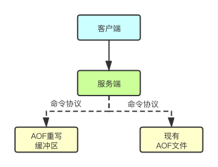

### 6. Redis持久化
由于Redis是内存数据库，如果Redis实例宕机或者服务器断电，则重启后，Redis中的数据会全部丢失。因此，Redis为了防止该情况，提供了两种持久化的方案——`RDB`和`AOF`，将内存中的数据保存到磁盘中，避免数据的丢失。

#### 6.1 RDB持久化
RDB持久化方案，指的是将某一时刻Redis实例的状态拍一个快照，以二进制文件的形式保存至磁盘中。在 Redis 重启动时， RDB 程序可以通过载入 RDB 文件来还原数据库的状态。这个过程可以**手动执行**，也可以在redis.conf文件中配置，**定期执行**。
RDB持久化通过`SAVE`和`BGSAVE`命令将Redis的状态保存为一个二进制文件，而Redis实例启动的时候，会自动加载RDB二进制文件，已恢复数据库的状态。下面，介绍下`SAVE`和`BGSAVE`两者的异同点。
* 相同点：
  两个命令都会调用 `rdbSave()` 函数。该函数负责将内存中的数据库数据以 RDB 格式保存到磁盘中， 如果 RDB 文件已存在， 那么新的 RDB 文件将替换已有的 RDB 文件。
* 不同点：
`SAVE`：**阻塞**Redis的服务器进程，直到RDB文件被创建完毕。
`BGSAVE`：派生(`fork`)一个子进程来创建新的RDB文件，记录接收到`BGSAVE`当时的数据库状态，父进程继续处理接收到的命令，子进程完成文件的创建之后，会发送信号给父进程，而与此同时，父进程处理命令的同时，通过轮询来接收子进程的信号。

`BGSAVE`可以在不阻塞主进程的情况下完成数据的备份。可以通过`redis.conf`中设置多个自动保存条件，只要有一个条件被满足，服务器就会执行`BGSAVE`命令。示例：
```
# 900s内有1次修改便执行RDB
save 900 1
# 300s内有10次修改便执行RDB
save 300 10
# 60s内有10000次修改便执行RDB
save 60 10000
```

#### 6.2 AOF持久化
AOF持久化是以**协议文本**的方式，将所有对数据库进行过**写入**的命令（及其参数）记录到 AOF 文件，以此达到记录数据库状态的目的。AOF持久化功能是默认关闭的，如需打开，需要将配置文件`redis.conf`中`appendonly no` 修改为 `appendonly yes`。
> 注意：如果服务器在启动时， 打开了 AOF 功能， 那么程序**优先使用 AOF 文件**来还原数据。 只有在 AOF 功能未打开的情况下， Redis 才会使用 RDB 文件来还原数据。

开启AOF之后，在进行Redis写操作的时候就会自动将命令保存到文件(默认`appendonly.aof`)中。写文件的频率可以通过`appendfsync`项进行配置，有以下三种策略：
* always：将缓存区的内容总是即时写到AOF文件中。
* everysec：将缓存区的内容每隔一秒写入AOF文件中。
* no ：写入AOF文件中的操作由操作系统决定，一般而言为了提高效率，操作系统会等待缓存区被填满，才会开始同步数据到磁盘。
> redis默认实用的是`everysec`，这是兼顾性能和安全性的保存方案，只会丢失最多2s的数据，性能又不会太差。

##### AOF重写
AOF文件通过同步 Redis 服务器所执行的命令， 从而实现了数据库状态的记录， 但是， 这种同步方式会造成一个问题： 随着运行时间的流逝， AOF 文件会变得越来越大。因此，AOF重写功能会首先读取数据库中现有的键值对状态，然后根据类型使用一条命令来替代之前的键值对多条命令。因此，**重写工作是针对数据库的当前值来进行的，程序既不读写、也不使用原有的 AOF 文件**。

注意，AOF是一个后台进程，不会阻塞服务端处理客户端的请求，这样做带来的好处是：
1. 子进程进行 AOF 重写期间，主进程可以继续处理命令请求。
2. 子进程带有主进程的数据副本，使用子进程而不是线程，可以在避免锁的情况下，保证数据的安全性。

但是，这又带来了一个新的问题——在AOF重写的过程，主进程还需要继续处理命令，而新的命令可能对现有的数据进行修改， 这会让当前数据库的数据和重写后的 AOF 文件中的数据不一致。因此Redis还设置了一个`AOF重写缓冲区`，这个缓冲区在子进程被创建开始之后开始使用，这个期间，所有的命令会被存两份，一份在AOF缓冲空间，一份在AOF重写缓冲区，当AOF重写完成之后，子进程发送信号给主进程，通知主进程将AOF重写缓冲区的内容添加到AOF文件中。

换言之， 当子进程在执行 AOF 重写时， 主进程需要执行以下三个工作：
1. 处理命令请求。
2. 将写命令追加到现有的 AOF 文件中。
3. 将写命令追加到 AOF 重写缓存中。

这样一来可以保证：
1. 现有的 AOF 功能会继续执行，即使在 AOF 重写期间发生停机，也不会有任何数据丢失。
2. 所有对数据库进行修改的命令都会被记录到 AOF 重写缓存中。

当子进程完成 AOF 重写之后， 它会向父进程发送一个完成信号， 父进程在接到完成信号之后， 会调用一个信号处理函数， 并完成以下工作：
1. 将 AOF 重写缓存中的内容全部写入到新 AOF 文件中。
2. 对新的 AOF 文件进行改名，覆盖原有的 AOF 文件。

#### 6.3 RDB VS AOF
*   `RDB`持久化，安全性较差，它是正常时期数据备份及 `master-slave`数据同步的最佳手段，文件尺寸较小，恢复数度较快。
*   `AOF`更安全，可将数据及时同步到文件中，但需要较多的磁盘IO，`AOF文件`尺寸较大，文件内容恢复相对较慢， 但更完整。

#### 6.4 相关配置选项
```
# 注释掉 `save` 这一行配置项就可以让保存数据库功能失效
# 设置redis进行数据库镜像的频率。
# 900秒（15分钟）内至少1个key值改变（则进行数据库保存--持久化）
# 300秒（5分钟）内至少10个key值改变（则进行数据库保存--持久化）
# 60秒（1分钟）内至少10000个key值改变（则进行数据库保存--持久化）
save 900 1
save 300 10
save 60 10000

# 当rdb持久化出现错误后，是否依然进行继续进行工作，
# yes：不能进行工作，
# no：可以继续进行工作，
# 可以通过info中的rdb_last_bgsave_status了解RDB持久化是否有错误
stop-writes-on-bgsave-error yes

# 使用压缩rdb文件
# yes：压缩，但是需要一些cpu的消耗
# no：不压缩，需要更多的磁盘空间
rdbcompression yes

# 是否校验rdb文件
rdbchecksum yes

# rdb文件的名称
dbfilename dump.rdb

# 数据目录，数据库的写入会在这个目录。rdb、aof文件也会写在这个目录
dir /var/lib/redis

# 默认redis使用的是rdb方式持久化，这种方式在许多应用中已经足够用了。
# 但是redis如果中途宕机，会导致可能有几分钟的数据丢失，根据save来策略进行持久化。
# Append Only File是另一种持久化方式，可以提供更好的持久化特性。
# Redis会把每次写入的数据在接收后都写入 appendonly.aof 文件，
# 每次启动时Redis都会先把这个文件的数据读入内存里，先忽略RDB文件。
appendonly yes

# aof文件名
appendfilename "appendonly.aof"

# aof持久化策略的配置
# no表示不执行fsync，由操作系统保证数据同步到磁盘，速度最快。
# always表示每次写入都执行fsync，以保证数据同步到磁盘。
# everysec表示每秒执行一次fsync，可能会导致丢失这1s数据。
appendfsync everysec

# 在aof重写或者写入rdb文件的时候，会执行大量IO。
# 此时对于everysec和always的aof模式来说，执行fsync会造成阻塞过长时间，
# no-appendfsync-on-rewrite字段设置为默认设置为no。
# 如果对延迟要求很高的应用，这个字段可以设置为yes，否则还是设置为no，
# 这样对持久化特性来说这是更安全的选择。
# 设置为yes表示rewrite期间对新写操作不fsync,暂时存在内存中,
# 等rewrite完成后再写入。Linux的默认fsync策略是30秒。可能丢失30秒数据。
no-appendfsync-on-rewrite no

# aof自动重写配置。当目前aof文件大小超过上一次重写的aof文件大小的百分之多少进行重写，
# 即当aof文件增长到一定大小的时候Redis能够调用bgrewriteaof对日志文件进行重写。
# 当前AOF文件大小是上次日志重写得到AOF文件大小的二倍（设置为100）时，
# 自动启动新的日志重写过程。
auto-aof-rewrite-percentage 100

# 设置允许重写的最小aof文件大小，避免了达到约定百分比但尺寸仍然很小的情况还要重写
auto-aof-rewrite-min-size 64mb

# aof文件可能在尾部是不完整的，当redis启动的时候，aof文件的数据被载入内存。
# 重启可能发生在redis所在的主机操作系统宕机后，
# 尤其在ext4文件系统没有加上data=ordered选项(redis宕机或者异常终止不会造成尾部不完整现象)。
# 出现这种现象，可以选择让redis退出，或者导入尽可能多的数据。
# 如果选择的是yes，当截断的aof文件被导入的时候，会自动发布一个log给客户端然后load。
# 如果是no，用户必须手动redis-check-aof修复AOF文件才可以。
aof-load-truncated yes
```

#### 上一篇：[Redis基本数据类型之有序集合](07-Redis基本数据类型之有序集合.md)
#### 下一篇：[Redis事务](09-Redis事务.md)