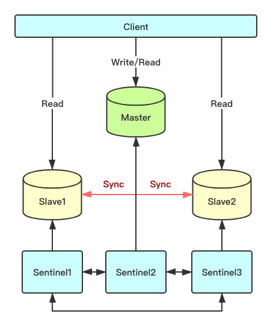

#### 8.2 哨兵模式
##### 8.2.1 哨兵架构
如下图所示，哨兵模式沿用了主从复制的基础架构，但是在主从复制的基础上添加了一些哨兵，来监控各节点的健康状态以及进行自动处理故障。



哨兵，顾名思义，就是来为Redis集群站哨的，一旦发现问题能做出相应的应对处理。其功能包括
- 监控主从节点是否正常运行。
- 当主节点出现故障时，能自动将一个从节点转换为主节点，当主节点恢复之后只能作为从节点。
- 多个哨兵可以监控同一个Redis，哨兵之间也会自动监控。

##### 8.2.2 实现原理
1. 在配置文件中通过 `sentinel monitor <master-name> <ip> <redis-port> <quorum>` 来定位Master节点的IP、端口，一个哨兵可以监控多个Master数据库，只需要提供多个该配置项即可。哨兵启动后，会与要监控的Master节点建立两条连接：
- 一条连接用来订阅Master的`_sentinel_:hello`频道与获取其他监控该Master哨兵的节点信息
- 另一条连接定期向Master发送`INFO`等命令获取Master本身的信息

与Master建立连接后，哨兵会执行三个操作：
- 定期（一般10s一次，当Master被标记为主观下线时，改为1s一次）向Master和Slave发送INFO命令
- 定期向Master和Slave的`_sentinel_:hello`频道发送自己的信息
- 定期（1s一次）向Master、Slave和其他哨兵发送`PING`命令

发送`INFO`命令可以获取当前数据库的相关信息从而实现新节点的自动发现。所以说哨兵只需要配置Master数据库信息就可以自动发现其Slave信息。获取到Slave信息后，哨兵也会与Slave建立两条连接执行监控。通过`INFO`命令，哨兵可以获取主从数据库的最新信息，并进行相应的操作，比如角色变更等。

接下来哨兵向主从数据库的`_sentinel_:hello`频道发送信息与同样监控这些数据库的哨兵共享自己的信息，发送内容为哨兵的IP、端口、运行id、配置版本、Master名字、Master的IP、端口还有Master的配置版本。这些信息有以下用处：
- 其他哨兵可以通过该信息判断发送者是否是新发现的哨兵，如果是的话会创建一个到该哨兵的连接用于发送`PING`命令。
- 其他哨兵通过该信息可以判断Master的版本，如果该版本高于自己记录的版本，将会更新。
- 当实现了自动发现Slave和其他哨兵节点后，哨兵就可以通过定期发送`PING`命令定时监控这些数据库和节点有没有停止服务。

如果被`PING`的数据库或者节点超时（通过 `sentinel down-after-milliseconds master-name milliseconds` 配置）未回复，哨兵认为其主观下线（`sdown`，s就是subjectively —— 主观地）。如果下线的是Master，哨兵会向其它哨兵发送命令询问它们是否也认为该Master主观下线，如果达到一定数目（即配置文件中的`quorum`）投票，哨兵会认为该Master已经客观下线（`odown`，o就是objectively —— 客观地），并选举领头的哨兵节点对主从系统发起故障恢复。若没有足够的sentinel进程同意Master下线，Master的客观下线状态会被移除，若Master重新向sentinel进程发送的`PING`命令返回有效回复，Master的主观下线状态就会被移除。

哨兵认为Master客观下线后，故障恢复的操作需要由选举的领头哨兵来执行，选举采用`Raft算法`：
- 发现Master下线的哨兵节点（记为`A`）向每个哨兵发送命令，要求对方选自己为领头哨兵；
- 如果目标哨兵节点没有选过其他人，则会同意选举`A`为领头哨兵；
- 如果有超过一半的哨兵同意选举`A`为领头，则`A`当选；
- 如果有多个哨兵节点同时参选领头，此时有可能存在一轮投票无竞选者胜出，此时每个参选的节点等待一个随机时间后再次发起参选请求，进行下一轮投票竞选，直至选举出领头哨兵。

领头哨兵被选举出来后，领头者开始对系统进行故障恢复，从出现故障的Master的从数据库中挑选一个来当选新的Master,选择规则如下：
- 所有在线的Slave中选择优先级最高的，优先级可以通过`slave-priority`配置
- 如果有多个最高优先级的Slave，则选取复制偏移量最大（即复制越完整）的当选
- 如果以上条件都一样，选取id最小的Slave

挑选出需要继任的Slave后，领头哨兵向该数据库发送命令使其升级为Master，然后再向其他Slave发送命令接受新的Master，最后更新数据。将已经停止的旧的Master更新为新的Master的从数据库，使其恢复服务后以Slave的身份继续运行。

##### 8.2.3 搭建过程
安装状态如下：

| 主机名  |  IP    |
| ------ | ------ |
| master / sentinel | 192.168.6.3 |
| slave1 / sentinel | 192.168.6.4 |
| slave2 / sentinel | 192.168.6.5 |

1. 主从节点的配置文件`redis.conf`，请参考[上一节](https://www.jianshu.com/p/88bbb38008da)的内容。
2. 修改哨兵节点的配置文件`sentinel.conf`，并将配置文件复制到`bin`目录下。
```
# 关闭保护模式
bind 0.0.0.0
protected-mode no

# 启动端口
port 26379

# 后台启动sentinel
daemonize yes

# 监控Master节点
# sentinel monitor <master-name> <ip> <redis-port> <quorum>
sentinel monitor mymaster 192.168.6.4 6379 2

# 如果哨兵节点5s后没有收到`PING`信号的回复，即认为Master节点主观下线，默认为30s。
sentinel down-after-milliseconds mymaster 5000

# 配置Master节点的连接密码
sentinel auth-pass mymaster Passw0rd
```
3. 在三个节点上分别启动sentinel。
```
redis-server sentinel.conf --sentinel
```
4.  启动成功后，每个节点上都会看到两个redis进程。
```
ps aux | grep redis
# hadoop   12334  0.3  0.4  69708  4644 ?        Ssl  12:46   0:11 ./redis-server 0.0.0.0:26379 [sentinel]
# hadoop     19138  0.2  0.5 150096  5056 ?        Ssl  13:26   0:01 ./redis-server 0.0.0.0:6379
```
5. 故障转移演示
进入主节点的redis客户端。
```
127.0.0.1:6379> info replication
# Replication
role:master
connected_slaves:2
slave0:ip=192.168.6.4,port=6379,state=online,offset=740922,lag=1
slave1:ip=192.168.6.5,port=6379,state=online,offset=740922,lag=1
master_replid:f0202b49b5d88ad57ed0bde33ffbc3b260924330
master_replid2:0000000000000000000000000000000000000000
master_repl_offset:179
second_repl_offset:-1
repl_backlog_active:1
repl_backlog_size:1048576
repl_backlog_first_byte_offset:1
repl_backlog_histlen:179
```
现在，我们模拟master挂掉的场景。
```
127.0.0.1:6379> shutdown
not connected> 
```
我们恢复旧的Master节点，即重启，查看其状态，会发现该节点已成为从节点。
```
127.0.0.1:6379> info replication
# Replication
role:slave
master_host:192.168.6.4
master_port:6379
master_link_status:up
master_last_io_seconds_ago:0
master_sync_in_progress:0
slave_repl_offset:738442
slave_priority:100
slave_read_only:1
connected_slaves:0
master_replid:5406a2471b20a04ccefa7e9ebf2298c8c771316f
master_replid2:0000000000000000000000000000000000000000
master_repl_offset:738442
second_repl_offset:-1
repl_backlog_active:1
repl_backlog_size:1048576
repl_backlog_first_byte_offset:536466
repl_backlog_histlen:201977
```
进入Slave1查看，发现Slave1节点已自动升级为Master。
```
127.0.0.1:6379> info replication
# Replication
role:master
connected_slaves:2
slave0:ip=192.168.6.5,port=6379,state=online,offset=740922,lag=1
slave1:ip=192.168.6.3,port=6379,state=online,offset=740922,lag=1
master_replid:5406a2471b20a04ccefa7e9ebf2298c8c771316f
master_replid2:a79ad1e7ee52520b208645df4abe70163042bf73
master_repl_offset:741059
second_repl_offset:432766
repl_backlog_active:1
repl_backlog_size:1048576
repl_backlog_first_byte_offset:350776
repl_backlog_histlen:390284
```

##### 8.2.4 优缺点分析
优点：
- 哨兵模式基于主从复制模式，所以主从复制模式有的优点，哨兵模式也有
- 哨兵模式下，Master挂掉可以自动进行切换，系统可用性更高

缺点：
- 同样也继承了主从模式难以在线扩容的缺点，Redis的容量受限于单机配置
- 需要额外的资源来启动sentinel进程，实现相对复杂一点，同时slave节点作为备份节点不提供服务


#### 上一篇：[Redis集群之主从复制模式](10-Redis集群之主从复制模式.md)
#### 下一篇：[Redis集群之Cluster模式](12-Redis集群之Cluster模式.md)