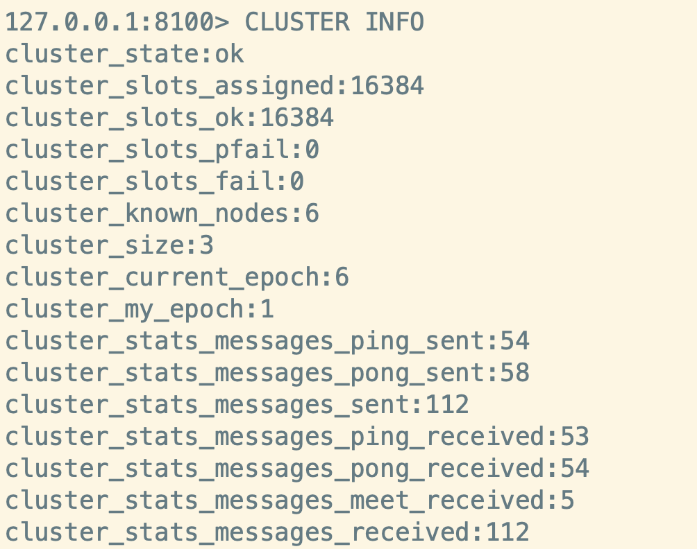

#### 8.3 Cluster模式
##### 8.3.1 架构设计
虽然[哨兵模式](https://www.jianshu.com/p/96c853247bc9)解决了主从复制不能自动故障转移，达不到高可用的问题，但还是存在难以在线扩容，Redis容量受限于单机配置的问题。Cluster模式实现了Redis的分布式存储，即每台节点存储不同的内容，来解决在线扩容的问题。

#### 8.3.2 实现原理
Cluster采用无中心结构,它的特点如下：
- 所有的Redis节点彼此互联(PING-PONG机制)，内部使用二进制协议优化传输速度和带宽；
- 节点的fail是通过集群中超过半数的节点检测失效时才生效；
- 客户端与Redis节点直连，不需要中间代理层。客户端不需要连接集群所有节点，连接集群中任何一个可用节点即可。

Cluster模式的具体工作机制：
1. 在Redis的每个节点上，都有一个插槽（slot），取值范围为0-16383；
2. 当我们存取key的时候，Redis会根据CRC16的算法得出一个结果，然后把结果对16384求余数，这样每个key都会对应一个编号在0-16383之间的哈希槽，通过这个值，去找到对应的插槽所对应的节点，然后直接自动跳转到这个对应的节点上进行存取操作；
3. 为了保证高可用，Cluster模式也引入主从复制模式，一个主节点对应一个或者多个从节点，当主节点宕机的时候，就会启用从节点；
4. 当其它主节点ping一个主节点A时，如果半数以上的主节点与A通信超时，那么认为主节点A宕机了。如果主节点A和它的从节点都宕机了，那么该集群就无法再提供服务了；
5. Cluster模式集群节点最小配置6个节点(3主3从，因为需要半数以上)，其中主节点提供读写操作，从节点作为备用节点，不提供请求，只作为故障转移使用。

#### 8.3.3 搭建过程
安装状态如下：
| 主机名  |  IP    | Redis 实例端口
| ------ | ------ | -----|
| master | 192.168.6.3 | 8100, 8200 |
| slave2  | 192.168.6.4 | 8100, 8200 |
| slave2  | 192.168.6.5 | 8100, 8200 |

1. 在主节点上都进行如下：复制bin文件夹，重命名为8100，8200。
```
cp -r bin 8100 
cp -r bin 8200 
```
并且修改配置文件redis.conf，主要修改如下配置：
```
port 8100 #8100端口下的实例，8200端口类似 
daemonize yes # r后台运行 
pidfile /var/run/redis_8100.pid
cluster-enabled yes # 开启集群模式 
masterauth Passw0rd # 如果设置了密码，需要指定master密码
cluster-config-file nodes_8100.conf # 集群的配置文件，同样对应8100, 8200等六个节点
cluster-node-timeout 15000 # 请求超时 默认15秒，可自行设置 
```
2.  将8100和8200两个文件夹发送至另外两个节点的相同路径下。
```
scp -r 8100 8200 slave1:$pwd
scp -r 8100 8200 slave2:$pwd
```
3. 分别启动6个实例
```
./redis-server redis.conf
```
验证下Redis实例是否启动。
```
ps aux | grep redis
```
如图所示，则代表实例启动成功。


4. 启动集群。
```
redis-cli --cluster create --cluster-replicas 1 192.168.6.3:8100 192.168.6.3:8200 192.168.6.4:8100 192.168.6.4:8200 192.168.6.5:8100 192.168.6.5:8200  -a Passw0rd
```


5. 查看集群信息和集群中的节点。



6. 使用集群存储数据。

> 注意：连接客户端时需要使用-c参数，即```redis-cli -p 8100 -c -a Passw0rd```否则会出现入图报错。


#### 8.3.4 优缺点分析
优点：
- 无中心架构，数据按照slot分布在多个节点。
- 集群中的每个节点都是平等的关系，每个节点都保存各自的数据和整个集群的状态。每个节点都和其他所有节点连接，而且这些连接保持活跃，这样就保证了我们只需要连接集群中的任意一个节点，就可以获取到其他节点的数据。
- 可线性扩展到1000多个节点，节点可动态添加或删除。
- 能够实现自动故障转移，节点之间通过gossip协议交换状态信息，用投票机制完成slave到master的角色转换。

缺点：
- 客户端实现复杂，驱动要求实现Smart Client，缓存slots mapping信息并及时更新，提高了开发难度。目前仅JedisCluster相对成熟，异常处理还不完善，比如常见的“max redirect exception”。
- 节点会因为某些原因发生阻塞（阻塞时间大于 cluster-node-timeout）被判断下线，这种failover是没有必要的
- 数据通过异步复制，不保证数据的强一致性。
- slave充当“冷备”，不能缓解读压力。
- 批量操作限制，目前只支持具有相同slot值的key执行批量操作，对mset、mget、sunion等操作支持不友好。
- key事务操作支持有线，只支持多key在同一节点的事务操作，多key分布不同节点时无法使用事务功能。
- 不支持多数据库空间，单机redis可以支持16个db，集群模式下只能使用一个，即db 0。
Redis Cluster模式不建议使用pipeline和multi-keys操作，减少max redirect产生的场景。

#### 上一篇：[Redis集群之哨兵模式](11-Redis集群之哨兵模式.md)
#### 下一篇：[Redis应用案例汇总](13-Redis应用案例汇总.md)